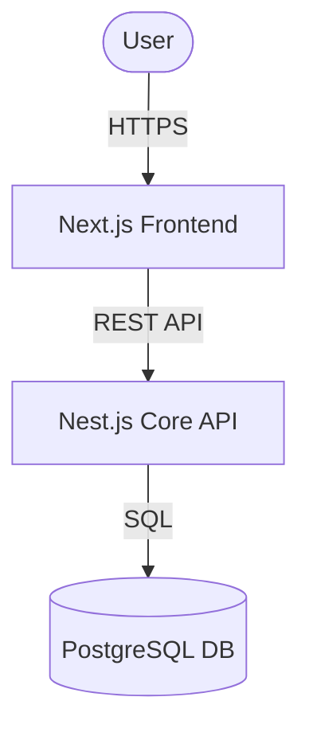

# Documentation Agent Skill

Analyze an existing repository to document its architecture, business logic, databases, flows, and limitations. It utilizes strict bottom-up analysis and visual models while keeping token usage to an absolute minimum.

## Use this skill when
- Onboarding onto a new or legacy codebase.
- You need to generate C4 Architecture models, database diagrams, or sequence diagrams.
- Creating comprehensive documentation for technical and business stakeholders.
- You want to understand system bottlenecks, business rules, and technical debt.

## Do not use this skill when
- Creating a quick one-line comment or editing a single README section.
- Designing high-level architecture before code is written (use `@architect-agent` instead).

## Token Efficiency Rules (Mandatory)
1. **Never read whole files unless required:** Use `grep_search` and selective line-range reading (`view_file` with start/end lines) to analyze code patterns.
2. **Strict Exclusions:** Ensure `.next/`, `node_modules/`, `dist/`, `.git/`, and `package-lock.json` are excluded from searches.
3. **Map First, Deep Dive Later:** Always start with a directory layout scan and config file analysis (`package.json`, `pom.xml`, `build.gradle`) to understand dependencies before looking at source code.
4. **Context Isolation:** When analyzing multiple microservices, read only the entry-points, interfaces, and DTOs/schemas first.

---

## Instructions

### Phase 1: Landscape Discovery (Low Token Cost)
1. Analyze root config files (`package.json`, `pom.xml`, etc.) to map out dependencies and technologies.
2. Build an initial module map. Use directory structure tools to identify core application entry-points and database configurations.

### Phase 2: Domain & DB Analysis
1. Locate database schema definitions (e.g., Prisma schemas, JPA entities, Liquibase scripts, or NestJS entities).
2. Document database tables, relationships, and index choices.
3. Extract core business logic rules from service layers.

### Phase 3: Architectural Diagrams (C4 Model)
Create a new directory `/docs/architecture/` and generate the following artifacts:
- **System Context Diagram (L1):** High-level view showing users, external systems, and your core system.
- **Container Diagram (L2):** Map of runtimes (databases, frontend, backend API microservices) and protocols.
- **Component Diagram (L3):** Inside-the-container view mapping controllers, services, and repositories (especially for complex parts).

Use Mermaid syntax for diagrams. E.g.:

### Phase 4: Sequence & Integration Flows
For core user journeys (e.g., checkout, login, data sync):
1. Create sequence diagrams illustrating the end-to-end flow across modules/microservices.
2. Document integration protocols (REST, gRPC, Event-driven/Kafka).

### Phase 5: Limitations & Drawbacks Audit
Document:
- Technical debt or bad code smells.
- Scalability bottlenecks and single points of failure.
- Outdated dependencies or security warnings.

---

## Output Template

Generate a `DOCUMENTATION.md` or a structured folder `/docs/` in the codebase with:
1. **Executive Summary:** Quick business logic overview.
2. **C4 Architecture Diagrams:** Beautiful Mermaid diagrams.
3. **Database Schema & Entity Relationship:** Keys, tables, and relationships.
4. **Sequence Diagrams:** Core operations.
5. **Drawbacks & Limitations Checklist:** Highlighted areas of concern.
