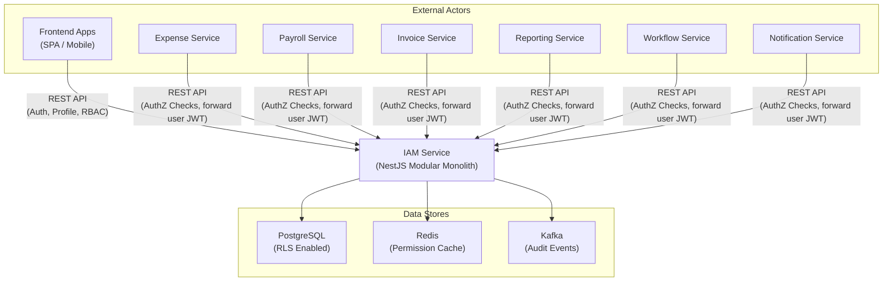
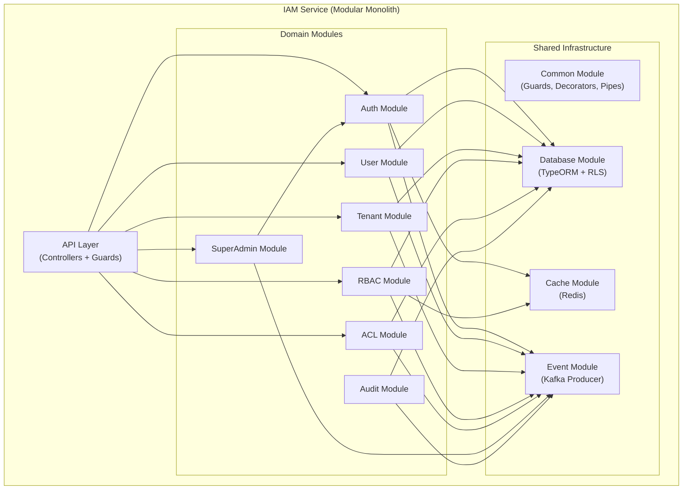
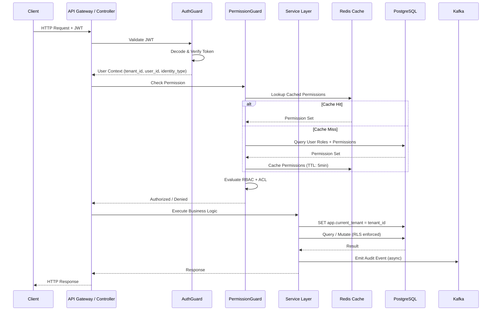
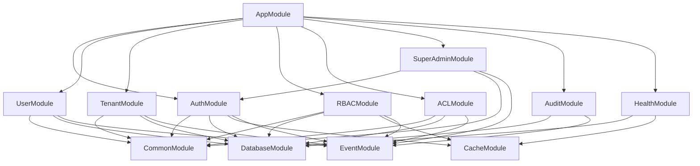
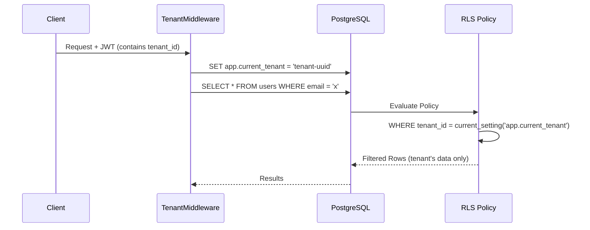
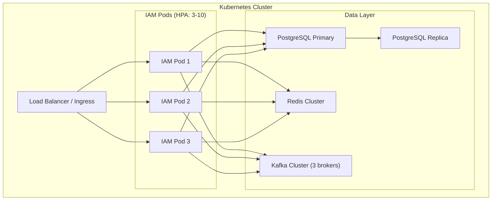

# IAM Service — High-Level Architecture

> **Version:** 1.0.0  
> **Status:** Approved for MVP  
> **Related:** [Requirements](./01-requirements.md) | [DB Schema](./03-database-schema.md) | [Flows](./04-flows.md) | [Strategies](./05-strategies.md)

---

## Table of Contents

1. [System Context (C4 Level 1)](#1-system-context-c4-level-1)
2. [Container Diagram (C4 Level 2)](#2-container-diagram-c4-level-2)
3. [Request Flow Overview](#3-request-flow-overview)
4. [Module Structure](#4-module-structure)
5. [Multi-Tenant Isolation Strategy](#5-multi-tenant-isolation-strategy)
6. [Scalability & Reliability](#6-scalability--reliability)
7. [Operational Concerns](#7-operational-concerns)
8. [Environment Configuration](#8-environment-configuration)
9. [Docker Compose — Development](#9-docker-compose--development)

---

## 1. System Context (C4 Level 1)



---

## 2. Container Diagram (C4 Level 2)



---

## 3. Request Flow Overview



---

## 4. Module Structure

### 4.1 NestJS Module Hierarchy

```
src/
├── main.ts
├── app.module.ts                    # Root module
│
├── common/                          # Shared infrastructure
│   ├── common.module.ts
│   ├── guards/
│   │   ├── jwt-auth.guard.ts        # JWT validation
│   │   ├── permission.guard.ts      # RBAC permission check
│   │   ├── acl.guard.ts             # Resource-level ACL check
│   │   └── identity-type.guard.ts   # Identity type enforcement
│   ├── decorators/
│   │   ├── current-user.decorator.ts
│   │   ├── require-permissions.decorator.ts
│   │   ├── require-acl.decorator.ts
│   │   ├── identity-types.decorator.ts
│   │   └── public.decorator.ts
│   ├── interceptors/
│   │   ├── correlation-id.interceptor.ts
│   │   ├── audit.interceptor.ts
│   │   └── response-transform.interceptor.ts
│   ├── pipes/
│   │   └── tenant-validation.pipe.ts
│   ├── filters/
│   │   └── global-exception.filter.ts
│   ├── interfaces/
│   │   ├── jwt-payload.interface.ts
│   │   ├── request-context.interface.ts
│   │   └── paginated-response.interface.ts
│   ├── base/
│   │   ├── base.entity.ts           # Generic audited entity
│   │   ├── base-tenant.entity.ts    # Tenant-scoped entity
│   │   ├── base.repository.ts       # Generic repository
│   │   ├── base.service.ts          # Generic service
│   │   └── base.controller.ts       # Generic controller
│   ├── constants/
│   │   ├── system-roles.constant.ts
│   │   ├── system-permissions.constant.ts
│   │   └── identity-types.constant.ts
│   └── utils/
│       ├── password.util.ts
│       └── permission-matcher.util.ts
│
├── database/                        # Database infrastructure
│   ├── database.module.ts
│   ├── migrations/
│   ├── seeds/
│   │   ├── super-admin.seed.ts
│   │   ├── system-roles.seed.ts
│   │   ├── system-permissions.seed.ts
│   │   └── service-accounts.seed.ts
│   └── rls/
│       └── rls-policies.sql
│
├── cache/                           # Redis cache module
│   ├── cache.module.ts
│   └── cache.service.ts
│
├── event/                           # Kafka event module
│   ├── event.module.ts
│   ├── event.producer.ts
│   └── event.consumer.ts
│
├── modules/
│   ├── auth/                        # Authentication domain
│   ├── tenant/                      # Tenant/Organization domain
│   ├── user/                        # User Management domain
│   ├── rbac/                        # RBAC domain
│   ├── acl/                         # ACL domain
│   ├── super-admin/                 # SuperAdmin domain
│   └── audit/                       # Audit domain
│
├── config/                          # Configuration
│   ├── app.config.ts
│   ├── database.config.ts
│   ├── jwt.config.ts
│   ├── redis.config.ts
│   └── kafka.config.ts
│
└── health/                          # Health checks
    ├── health.module.ts
    └── health.controller.ts
```

### 4.2 Module Dependency Graph



### 4.3 Clean Architecture Layers Per Module

```
Module/
├── Controller (Interface/Adapter Layer)
│   └── HTTP request/response, DTOs, decorators
│
├── Service (Application/Use Case Layer)
│   └── Business logic, orchestration, validation
│
├── Entity (Domain Layer)
│   └── Domain models, business rules, value objects
│
└── Repository (Infrastructure Layer)
    └── Data access, TypeORM queries, cache access
```

**Dependency Rule:** Dependencies flow inward only → Controller → Service → Entity. Infrastructure adapts to domain, never the reverse.

---

## 5. Multi-Tenant Isolation Strategy

### 5.1 Approach: Shared Database + PostgreSQL RLS

All tenants share a single database. Every tenant-scoped table contains a `tenant_id` column. PostgreSQL Row-Level Security (RLS) enforces isolation at the database level.

### 5.2 RLS Implementation

```sql
-- Enable RLS on tenant-scoped tables
ALTER TABLE users ENABLE ROW LEVEL SECURITY;
ALTER TABLE roles ENABLE ROW LEVEL SECURITY;
ALTER TABLE permissions ENABLE ROW LEVEL SECURITY;
ALTER TABLE user_roles ENABLE ROW LEVEL SECURITY;
ALTER TABLE role_permissions ENABLE ROW LEVEL SECURITY;
ALTER TABLE resource_acls ENABLE ROW LEVEL SECURITY;

-- Policy: tenant can only see its own data
CREATE POLICY tenant_isolation ON users
    USING (tenant_id = current_setting('app.current_tenant')::uuid);

CREATE POLICY tenant_isolation ON roles
    USING (
        is_system = true 
        OR tenant_id = current_setting('app.current_tenant')::uuid
    );

-- SuperAdmin bypass: separate DB role with BYPASSRLS
CREATE ROLE iam_superadmin BYPASSRLS;
```

### 5.3 Tenant Context Middleware

Every request sets the tenant context before any query:

```typescript
@Injectable()
export class TenantContextMiddleware implements NestMiddleware {
  async use(req: Request, res: Response, next: NextFunction) {
    const tenantId = extractTenantFromJWT(req);
    
    // Set PostgreSQL session variable for RLS
    await this.dataSource.query(
      `SET app.current_tenant = '${tenantId}'`
    );
    
    next();
  }
}
```

### 5.4 Tenant Isolation Flow



### 5.5 Multi-Tenancy Strategy Comparison

| Aspect | Shared DB + RLS | Schema per Tenant | DB per Tenant |
|--------|----------------|-------------------|---------------|
| **Isolation** | Row-level (strong with RLS) | Schema-level (strong) | Full (strongest) |
| **Operational Cost** | Low (1 DB) | Medium (N schemas) | High (N databases) |
| **Migration Complexity** | Low (1 migration) | High (N migrations) | Very High |
| **Query Performance** | Good (proper indexing) | Good | Best |
| **Connection Pooling** | Simple | Complex | Very Complex |
| **Cross-Tenant Queries** | Easy (SuperAdmin) | Harder | Hardest |
| **Max Tenants** | 100,000+ | ~10,000 | ~1,000 |

**Decision:** Shared DB + RLS chosen for simplicity, scalability, and operational efficiency. RLS provides strong isolation with minimal overhead.

---

## 6. Scalability & Reliability

### 6.1 Scalability Vectors

| Component | Scaling Strategy | Bottleneck | Mitigation |
|-----------|-----------------|------------|------------|
| **API Server** | Horizontal (add NestJS instances behind LB) | CPU on authz checks | Redis cache offloads DB |
| **PostgreSQL** | Vertical first, then read replicas | Write throughput on audit_logs | Kafka buffers writes; batch inserts |
| **Redis** | Redis Cluster (sharding) | Memory for 10M user permission sets | TTL-based eviction; compact permission format |
| **Kafka** | Partition by tenant_id | Consumer throughput | Multiple consumer instances |

### 6.2 Connection Pooling

```
NestJS App (N instances)
    └── TypeORM Connection Pool (per instance)
        └── PostgreSQL (max_connections = 200)
```

- Each NestJS instance manages its own TypeORM connection pool
- Pool size: 10-20 connections per instance, tuned based on instance count
- **PgBouncer:** Deferred to Phase 4 — adds value when scaling beyond 10+ app instances

### 6.3 Capacity Estimates

| Metric | Estimate | Notes |
|--------|----------|-------|
| **Users** | 10M | ~1000 users per tenant × 10,000 tenants |
| **Permission cache entries** | 10M keys | ~64 bytes per key, ~1KB per value = ~10GB Redis |
| **Audit events/day** | ~50M | 5 events/user/day average |
| **Auth requests/sec** | 1,000 | Login spike: 3× during business hours |
| **AuthZ requests/sec** | 10,000 | Each service request triggers 1-2 authz checks |
| **DB size (1 year)** | ~500GB | Dominated by audit_logs |

### 6.4 Reliability Patterns

| Pattern | Implementation | Purpose |
|---------|---------------|---------|
| **Circuit Breaker** | On Redis connection | Graceful degradation if cache is down (fall back to DB) |
| **Retry with Backoff** | Kafka producer | Handle transient Kafka failures |
| **Health Checks** | `/health/ready`, `/health/live` | K8s liveness/readiness probes |
| **Graceful Shutdown** | `app.enableShutdownHooks()` | Drain connections before termination |
| **Idempotent Operations** | UUID-based idempotency keys | Prevent duplicate writes on retries |

### 6.5 Failure Modes

| Failure | Impact | Mitigation |
|---------|--------|------------|
| **Redis down** | Authz latency increases (DB fallback) | Circuit breaker; permission check still works via DB |
| **Kafka down** | Audit events buffer in memory | In-memory queue with disk spillover; alert on failure |
| **PostgreSQL down** | Full service outage | Standby replica with automatic failover |
| **JWT secret compromised** | All tokens are invalid | Key rotation; short TTL limits blast radius |

---

## 7. Operational Concerns

### 7.1 Monitoring

| Metric | Type | Alert Threshold |
|--------|------|----------------|
| Auth success rate | Counter | < 95% → warning |
| Auth latency p95 | Histogram | > 500ms → warning |
| AuthZ latency p95 | Histogram | > 100ms → critical |
| Redis cache hit rate | Gauge | < 80% → warning |
| DB connection pool usage | Gauge | > 80% → warning |
| Kafka consumer lag | Gauge | > 10,000 → warning |
| Active users | Gauge | Informational |
| Failed login attempts | Counter | > 100/min per tenant → alert |

### 7.2 Structured Logging

All logs follow structured JSON format:

```json
{
  "level": "info",
  "message": "User login successful",
  "timestamp": "2026-06-04T16:00:00Z",
  "correlation_id": "req-uuid",
  "tenant_id": "tenant-uuid",
  "user_id": "user-uuid",
  "action": "AUTH_LOGIN",
  "duration_ms": 45,
  "ip_address": "192.168.1.1"
}
```

### 7.3 Correlation IDs

Every request gets a unique `X-Correlation-ID` header (generated if not provided). This ID:
- Propagated to all downstream calls
- Included in all log entries
- Stored in audit events
- Returned in error responses

### 7.4 Debugging

| Tool | Purpose |
|------|---------|
| Correlation ID tracing | Follow a request across services |
| Audit log queries | Investigate who did what, when |
| Permission evaluation endpoint | `GET /debug/evaluate-permissions?user_id=x&permission=y` (SuperAdmin only) |
| Health check endpoints | Verify connectivity to DB, Redis, Kafka |

### 7.5 Deployment Architecture



---

## 8. Environment Configuration

```yaml
# .env example
# Application
APP_PORT=3000
APP_ENV=production
APP_LOG_LEVEL=info

# PostgreSQL
DB_HOST=localhost
DB_PORT=5432
DB_NAME=iam
DB_USERNAME=iam_app
DB_PASSWORD=<secure>
DB_SSL=true

# Redis
REDIS_HOST=localhost
REDIS_PORT=6379
REDIS_PASSWORD=<secure>
REDIS_DB=0

# Kafka
KAFKA_BROKERS=localhost:9092
KAFKA_CLIENT_ID=iam-service
KAFKA_GROUP_ID=iam-consumers

# JWT
JWT_SECRET=<secure-256-bit-key>
JWT_ACCESS_TTL=900
JWT_REFRESH_TTL=604800

# SuperAdmin (bootstrap)
SUPER_ADMIN_EMAIL=superadmin@platform.com
SUPER_ADMIN_PASSWORD=<secure>

# Impersonation
IMPERSONATION_MAX_TTL=1800
```

---

## 9. Docker Compose — Development

```yaml
version: '3.8'
services:
  iam:
    build: .
    ports:
      - "3000:3000"
    environment:
      - DB_HOST=postgres
      - REDIS_HOST=redis
      - KAFKA_BROKERS=kafka:9092
    depends_on:
      - postgres
      - redis
      - kafka

  postgres:
    image: postgres:16
    environment:
      POSTGRES_DB: iam
      POSTGRES_USER: iam_app
      POSTGRES_PASSWORD: devpassword
    ports:
      - "5432:5432"
    volumes:
      - pgdata:/var/lib/postgresql/data

  redis:
    image: redis:7-alpine
    ports:
      - "6379:6379"
    command: redis-server --requirepass devpassword

  zookeeper:
    image: confluentinc/cp-zookeeper:7.5.0
    environment:
      ZOOKEEPER_CLIENT_PORT: 2181

  kafka:
    image: confluentinc/cp-kafka:7.5.0
    depends_on:
      - zookeeper
    ports:
      - "9092:9092"
    environment:
      KAFKA_BROKER_ID: 1
      KAFKA_ZOOKEEPER_CONNECT: zookeeper:2181
      KAFKA_ADVERTISED_LISTENERS: PLAINTEXT://kafka:9092
      KAFKA_OFFSETS_TOPIC_REPLICATION_FACTOR: 1

volumes:
  pgdata:
```

---

> **Related Documents:**
> - [01-requirements.md](./01-requirements.md) — Functional & non-functional requirements
> - [03-database-schema.md](./03-database-schema.md) — PostgreSQL schema and ERD
> - [04-flows.md](./04-flows.md) — Auth, authz, and onboarding sequence diagrams
> - [05-strategies.md](./05-strategies.md) — Design decisions and approaches
