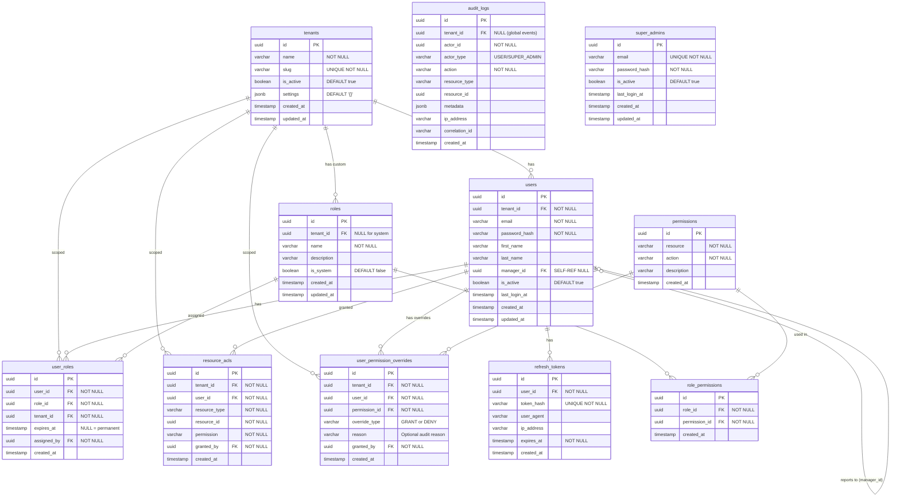

# IAM Service — Database Schema & ERD

> **Version:** 1.0.0  
> **Status:** Approved for MVP  
> **Related:** [Architecture](./02-architecture.md) | [Flows](./04-flows.md) | [API Reference](./06-api-reference.md)

---

## Table of Contents

1. [Entity Relationship Diagram](#1-entity-relationship-diagram)
2. [Entity Definitions](#2-entity-definitions)
3. [Key Indexes](#3-key-indexes)
4. [Base Entities (TypeORM)](#4-base-entities-typeorm)
5. [RLS Policies](#5-rls-policies)
6. [Migration Reference](#6-migration-reference)

---

## 1. Entity Relationship Diagram



---

## 2. Entity Definitions

### 2.1 `tenants`

Central entity representing each organization (company/team) on the platform.

| Column | Type | Constraints | Description |
|--------|------|-------------|-------------|
| `id` | `uuid` | PK | Tenant unique identifier |
| `name` | `varchar` | NOT NULL | Display name (e.g., "Acme Corp") |
| `slug` | `varchar` | UNIQUE NOT NULL | URL-safe identifier (e.g., `acme-corp`) |
| `is_active` | `boolean` | DEFAULT true | Soft delete flag |
| `settings` | `jsonb` | DEFAULT `'{}'` | Tenant config (features, limits) |
| `created_at` | `timestamp` | AUTO | Record creation time |
| `updated_at` | `timestamp` | AUTO | Last update time |

### 2.2 `users`

Human users belonging to a tenant. SuperAdmins are stored in the separate `super_admins` table.

| Column | Type | Constraints | Description |
|--------|------|-------------|-------------|
| `id` | `uuid` | PK | User unique identifier |
| `tenant_id` | `uuid` | FK → tenants, NOT NULL | Owning tenant |
| `email` | `varchar` | NOT NULL | Login email (unique within tenant) |
| `password_hash` | `varchar` | NOT NULL | bcrypt hash (cost 12) |
| `first_name` | `varchar` | NULL | Display name |
| `last_name` | `varchar` | NULL | Display name |
| `manager_id` | `uuid` | FK → users (self-ref), NULL | Org hierarchy parent |
| `is_active` | `boolean` | DEFAULT true | Account status |
| `last_login_at` | `timestamp` | NULL | Last successful login |
| `created_at` | `timestamp` | AUTO | Record creation time |
| `updated_at` | `timestamp` | AUTO | Last update time |

> **RLS applies:** Queries are automatically scoped to `tenant_id = current_setting('app.current_tenant')`.

### 2.3 `roles`

Role templates that aggregate permissions. Can be system-wide (pre-seeded) or tenant-specific (custom).

| Column | Type | Constraints | Description |
|--------|------|-------------|-------------|
| `id` | `uuid` | PK | Role unique identifier |
| `tenant_id` | `uuid` | FK → tenants, NULL | NULL = system role (visible to all tenants) |
| `name` | `varchar` | NOT NULL | Role identifier (e.g., `EXPENSE_MANAGER`) |
| `description` | `varchar` | NULL | Human-readable description |
| `is_system` | `boolean` | DEFAULT false | TRUE = pre-seeded, cannot be deleted |
| `created_at` | `timestamp` | AUTO | |
| `updated_at` | `timestamp` | AUTO | |

### 2.4 `permissions`

Atomic permission codes in `resource:action` format. Shared globally (no tenant scoping).

| Column | Type | Constraints | Description |
|--------|------|-------------|-------------|
| `id` | `uuid` | PK | Permission unique identifier |
| `resource` | `varchar` | NOT NULL | Resource domain (e.g., `expense`, `payroll`) |
| `action` | `varchar` | NOT NULL | Action name (e.g., `read`, `write`, `delete`) |
| `description` | `varchar` | NULL | Human-readable description |
| `created_at` | `timestamp` | AUTO | |

> **Note:** Permission `code` = `resource:action`. Wildcard `resource:*` is evaluated at runtime, not stored.

### 2.5 `user_roles`

Junction table assigning roles to users within a tenant. Supports time-bound assignments.

| Column | Type | Constraints | Description |
|--------|------|-------------|-------------|
| `id` | `uuid` | PK | |
| `user_id` | `uuid` | FK → users, NOT NULL | Target user |
| `role_id` | `uuid` | FK → roles, NOT NULL | Assigned role |
| `tenant_id` | `uuid` | FK → tenants, NOT NULL | Tenant scope |
| `expires_at` | `timestamp` | NULL | NULL = permanent. Set for time-bound access |
| `assigned_by` | `uuid` | FK → users, NOT NULL | Admin who made the assignment |
| `created_at` | `timestamp` | AUTO | |

### 2.6 `role_permissions`

Junction table linking permissions to roles.

| Column | Type | Constraints | Description |
|--------|------|-------------|-------------|
| `id` | `uuid` | PK | |
| `role_id` | `uuid` | FK → roles, NOT NULL | Role receiving the permission |
| `permission_id` | `uuid` | FK → permissions, NOT NULL | Permission granted |
| `created_at` | `timestamp` | AUTO | |

### 2.7 `user_permission_overrides`

Sparse table for per-user GRANT or DENY overrides on top of their role permissions.

| Column | Type | Constraints | Description |
|--------|------|-------------|-------------|
| `id` | `uuid` | PK | |
| `tenant_id` | `uuid` | FK → tenants, NOT NULL | Tenant scope |
| `user_id` | `uuid` | FK → users, NOT NULL | Target user |
| `permission_id` | `uuid` | FK → permissions, NOT NULL | Permission being overridden |
| `override_type` | `varchar` | NOT NULL | `GRANT` or `DENY` |
| `reason` | `varchar` | NULL | Audit reason |
| `granted_by` | `uuid` | FK → users, NOT NULL | Admin who created the override |
| `created_at` | `timestamp` | AUTO | |

> **Evaluation:** `effective = (role_permissions ∪ GRANT_overrides) − DENY_overrides`. DENY always wins.

### 2.8 `resource_acls`

Resource-level access control entries. Grants a specific user access to a specific resource instance.

| Column | Type | Constraints | Description |
|--------|------|-------------|-------------|
| `id` | `uuid` | PK | |
| `tenant_id` | `uuid` | FK → tenants, NOT NULL | Tenant scope |
| `user_id` | `uuid` | FK → users, NOT NULL | User receiving access |
| `resource_type` | `varchar` | NOT NULL | Domain name (e.g., `expense`, `invoice`) |
| `resource_id` | `uuid` | NOT NULL | Specific resource instance ID |
| `permission` | `varchar` | NOT NULL | Permission string (e.g., `approve`) |
| `granted_by` | `uuid` | FK → users, NOT NULL | Admin who granted access |
| `created_at` | `timestamp` | AUTO | |

### 2.9 `refresh_tokens`

Stores hashed refresh tokens for rotation-based JWT renewal.

| Column | Type | Constraints | Description |
|--------|------|-------------|-------------|
| `id` | `uuid` | PK | |
| `user_id` | `uuid` | FK → users, NOT NULL | Owning user |
| `token_hash` | `varchar` | UNIQUE NOT NULL | SHA-256 hash of token (not stored plaintext) |
| `user_agent` | `varchar` | NULL | Client browser/app identifier |
| `ip_address` | `varchar` | NULL | Source IP for audit |
| `expires_at` | `timestamp` | NOT NULL | Token expiry (7 days) |
| `created_at` | `timestamp` | AUTO | |

### 2.10 `audit_logs`

Append-only log table consuming events from the `iam.audit` Kafka topic.

| Column | Type | Constraints | Description |
|--------|------|-------------|-------------|
| `id` | `uuid` | PK | |
| `tenant_id` | `uuid` | FK → tenants, NULL | NULL for global events (SuperAdmin actions) |
| `actor_id` | `uuid` | NOT NULL | User who performed the action |
| `actor_type` | `varchar` | NOT NULL | `USER` or `SUPER_ADMIN` |
| `action` | `varchar` | NOT NULL | Event name (e.g., `AUTH_LOGIN_SUCCESS`) |
| `resource_type` | `varchar` | NULL | Resource affected |
| `resource_id` | `uuid` | NULL | Specific resource instance |
| `metadata` | `jsonb` | NULL | Additional context (IP, user agent, changes) |
| `ip_address` | `varchar` | NULL | Source IP |
| `correlation_id` | `varchar` | NULL | Request correlation ID |
| `created_at` | `timestamp` | AUTO | Immutable — no `updated_at` |

### 2.11 `super_admins`

Global administrators with cross-tenant visibility. Stored separately from tenant users.

| Column | Type | Constraints | Description |
|--------|------|-------------|-------------|
| `id` | `uuid` | PK | |
| `email` | `varchar` | UNIQUE NOT NULL | Login email |
| `password_hash` | `varchar` | NOT NULL | bcrypt hash |
| `is_active` | `boolean` | DEFAULT true | Account status |
| `last_login_at` | `timestamp` | NULL | Last login |
| `created_at` | `timestamp` | AUTO | |
| `updated_at` | `timestamp` | AUTO | |

---

## 3. Key Indexes

```sql
-- Users: tenant-scoped email lookup + active filter
CREATE INDEX idx_users_tenant_email ON users(tenant_id, email);
CREATE INDEX idx_users_tenant_active ON users(tenant_id, is_active);
CREATE INDEX idx_users_manager ON users(manager_id) WHERE manager_id IS NOT NULL;
CREATE UNIQUE INDEX idx_users_email_tenant ON users(tenant_id, email);

-- User roles: permission resolution hot path
CREATE INDEX idx_user_roles_user ON user_roles(user_id);
CREATE INDEX idx_user_roles_tenant_user ON user_roles(tenant_id, user_id);
CREATE INDEX idx_user_roles_expiry ON user_roles(expires_at) WHERE expires_at IS NOT NULL;

-- Role permissions: role → permission join
CREATE INDEX idx_role_permissions_role ON role_permissions(role_id);

-- Resource ACLs: ACL lookup hot path
CREATE INDEX idx_resource_acls_user_resource ON resource_acls(user_id, resource_type, resource_id);
CREATE INDEX idx_resource_acls_tenant ON resource_acls(tenant_id);

-- User permission overrides
CREATE INDEX idx_user_perm_overrides_user ON user_permission_overrides(user_id);
CREATE INDEX idx_user_perm_overrides_tenant_user ON user_permission_overrides(tenant_id, user_id);
CREATE UNIQUE INDEX idx_user_perm_overrides_unique ON user_permission_overrides(tenant_id, user_id, permission_id);

-- Refresh tokens
CREATE INDEX idx_refresh_tokens_user ON refresh_tokens(user_id);
CREATE INDEX idx_refresh_tokens_hash ON refresh_tokens(token_hash);
CREATE INDEX idx_refresh_tokens_expiry ON refresh_tokens(expires_at);

-- Audit logs: queryable by tenant, actor, action, time
CREATE INDEX idx_audit_logs_tenant ON audit_logs(tenant_id);
CREATE INDEX idx_audit_logs_actor ON audit_logs(actor_id);
CREATE INDEX idx_audit_logs_action ON audit_logs(action);
CREATE INDEX idx_audit_logs_created ON audit_logs(created_at);
CREATE INDEX idx_audit_logs_correlation ON audit_logs(correlation_id);

-- Permissions: unique constraint on resource:action
CREATE UNIQUE INDEX idx_permissions_resource_action ON permissions(resource, action);
```

---

## 4. Base Entities (TypeORM)

```typescript
// All entities extend this
@Entity()
export abstract class BaseEntity {
  @PrimaryGeneratedColumn('uuid')
  id: string;

  @CreateDateColumn()
  created_at: Date;

  @UpdateDateColumn()
  updated_at: Date;
}

// Tenant-scoped entities extend this
@Entity()
export abstract class BaseTenantEntity extends BaseEntity {
  @Column({ type: 'uuid' })
  tenant_id: string;

  @ManyToOne(() => TenantEntity)
  @JoinColumn({ name: 'tenant_id' })
  tenant: TenantEntity;
}
```

---

## 5. RLS Policies

```sql
-- Enable RLS on all tenant-scoped tables
ALTER TABLE users ENABLE ROW LEVEL SECURITY;
ALTER TABLE roles ENABLE ROW LEVEL SECURITY;
ALTER TABLE user_roles ENABLE ROW LEVEL SECURITY;
ALTER TABLE role_permissions ENABLE ROW LEVEL SECURITY;
ALTER TABLE resource_acls ENABLE ROW LEVEL SECURITY;
ALTER TABLE user_permission_overrides ENABLE ROW LEVEL SECURITY;

-- Tenant isolation policy
CREATE POLICY tenant_isolation ON users
    USING (tenant_id = current_setting('app.current_tenant')::uuid);

CREATE POLICY tenant_isolation ON user_roles
    USING (tenant_id = current_setting('app.current_tenant')::uuid);

CREATE POLICY tenant_isolation ON resource_acls
    USING (tenant_id = current_setting('app.current_tenant')::uuid);

CREATE POLICY tenant_isolation ON user_permission_overrides
    USING (tenant_id = current_setting('app.current_tenant')::uuid);

-- Roles: allow system roles (visible to all tenants) + tenant's own custom roles
CREATE POLICY tenant_isolation ON roles
    USING (
        is_system = true 
        OR tenant_id = current_setting('app.current_tenant')::uuid
    );

-- SuperAdmin bypass: DB role with BYPASSRLS privilege
CREATE ROLE iam_superadmin BYPASSRLS;
GRANT iam_superadmin TO iam_app;
```

> **Note:** The `app.current_tenant` session variable is set by `TenantTransactionInterceptor` for every request. SuperAdmin requests use the `iam_superadmin` DB role which bypasses all RLS policies.

---

## 6. Migration Reference

Migrations are managed via TypeORM and located at:

```
src/database/migrations/
```

Run migrations:
```bash
npm run migration:run
npm run migration:revert   # rollback last
npm run migration:generate -- --name=AddSomeFeature
```

Seed data (run after migrations):
```bash
npm run seed
```

Seeds include:
- `super-admin.seed.ts` — Creates default SuperAdmin from env vars
- `system-roles.seed.ts` — Seeds 15+ predefined system roles
- `system-permissions.seed.ts` — Seeds all permission codes (resource:action pairs)

---

> **Related Documents:**
> - [04-flows.md](./04-flows.md) — Auth and authz flow diagrams referencing this schema
> - [06-api-reference.md](./06-api-reference.md) — API request/response bodies for CRUD on these entities
> - [02-architecture.md](./02-architecture.md) — RLS and multi-tenant strategy context
