# IAM Service — Authentication, Authorization & Flow Diagrams

> **Version:** 1.0.0  
> **Status:** Approved for MVP  
> **Related:** [Architecture](./02-architecture.md) | [DB Schema](./03-database-schema.md) | [API Reference](./06-api-reference.md) | [Strategies](./05-strategies.md)

---

## Flow Index

| # | Flow | Diagram Type | Section |
|---|------|-------------|---------|
| 1 | User Login | Sequence | [§1.2](#12-user-login-flow) |
| 2 | Token Refresh | Sequence | [§1.3](#13-token-refresh-flow) |
| 3 | Logout | Sequence | [§1.4](#14-logout-flow) |
| 4 | Authorization Decision | Flowchart | [§2.1](#21-authorization-decision-flow) |
| 5 | Permission Hierarchy | Text diagram | [§2.2](#22-permission-hierarchy) |
| 6 | Microservice AuthZ (SDK) | Sequence | [§2.3](#23-microservice-authorization-via-sdk) |
| 7 | Cache Invalidation | Sequence | [§3.1](#31-cache-invalidation-flow) |
| 8 | Tenant Isolation | Sequence | [§4.1](#41-tenant-isolation-flow) |
| 9 | Cross-Service AuthZ Check | Sequence | [§5.1](#51-cross-service-authorization-check) |
| 10 | Async Kafka Flow | Sequence | [§5.2](#52-async-kafka-flow) |
| 11 | Impersonation | Sequence | [§6.1](#61-impersonation-flow) |
| 12 | Audit Pipeline | Flowchart | [§7.1](#71-audit-pipeline) |

---

## Table of Contents

1. [Authentication Flows](#1-authentication-flows)
2. [Authorization Flows](#2-authorization-flows)
3. [Cache Invalidation Flow](#3-cache-invalidation-flow)
4. [Multi-Tenant Isolation Flow](#4-multi-tenant-isolation-flow)
5. [Service-to-Service Communication Flows](#5-service-to-service-communication-flows)
6. [SuperAdmin & Impersonation Flow](#6-superadmin--impersonation-flow)
7. [Audit Flow](#7-audit-flow)

---

## 1. Authentication Flows

### 1.1 Identity Types

| Type | Description | Token Claims | Use Case |
|------|-------------|-------------|----------|
| `USER` | Human user within a tenant | user_id, tenant_id, identity_type | Normal user operations |
| `SUPER_ADMIN` | Global administrator | user_id, identity_type (no tenant_id) | Cross-tenant operations |
| `IMPERSONATION` | SuperAdmin acting as user | user_id, tenant_id, impersonator_id, identity_type | Support/debugging |

> **Note:** No `SERVICE` identity type. All microservices run in the same K8s cluster and forward the user's JWT. K8s NetworkPolicies enforce which pods can communicate.

### JWT Token Structures

**Access Token Payload:**
```json
{
  "sub": "user-uuid",
  "tenant_id": "tenant-uuid",
  "identity_type": "USER",
  "iat": 1700000000,
  "exp": 1700000900
}
```

**SuperAdmin Token Payload:**
```json
{
  "sub": "superadmin-uuid",
  "identity_type": "SUPER_ADMIN",
  "iat": 1700000000,
  "exp": 1700000900
}
```

**Impersonation Token Payload:**
```json
{
  "sub": "target-user-uuid",
  "tenant_id": "target-tenant-uuid",
  "identity_type": "IMPERSONATION",
  "impersonator_id": "superadmin-uuid",
  "iat": 1700000000,
  "exp": 1700001800
}
```

### 1.2 User Login Flow

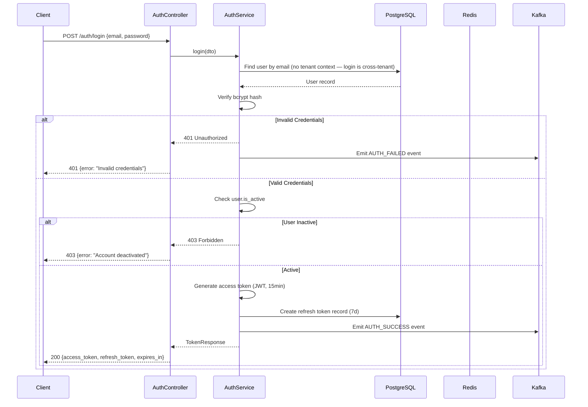

### 1.3 Token Refresh Flow

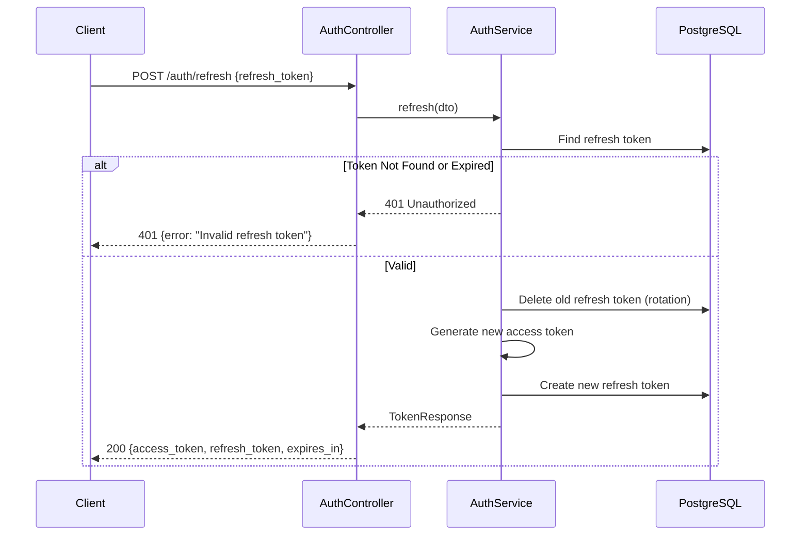

### 1.4 Logout Flow

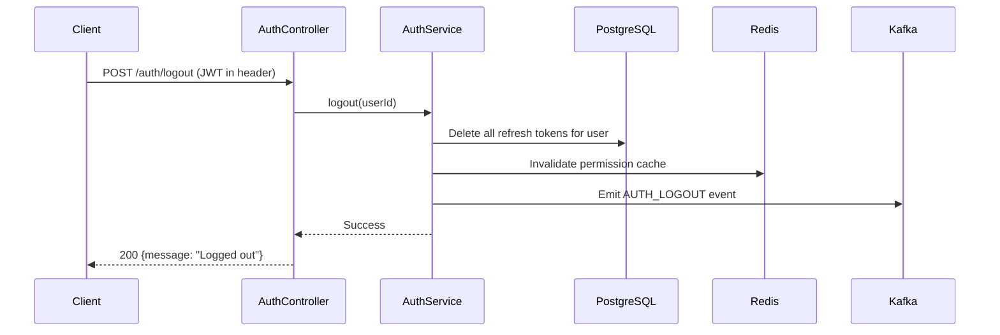

> **Note:** Access tokens are stateless JWTs and cannot be individually revoked. They expire naturally (15min). For immediate revocation, a token blacklist in Redis can be added post-MVP.

---

## 2. Authorization Flows

### 2.1 Authorization Decision Flow

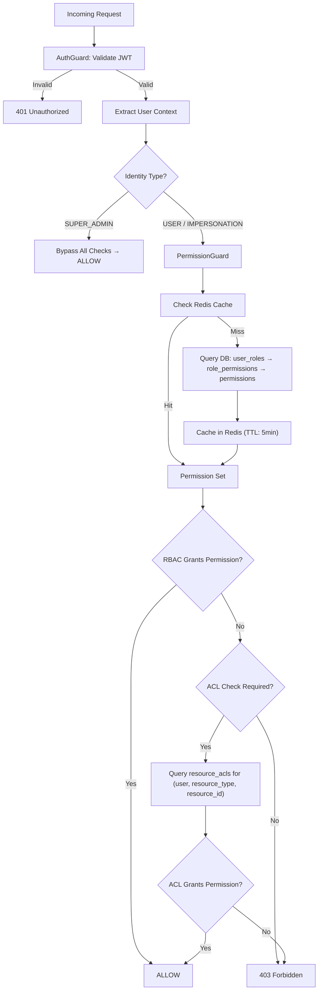

### 2.2 Permission Hierarchy

Permissions follow the pattern `resource:action`. Wildcards enable hierarchical inheritance.

```
Permission Hierarchy:
    *:*                    ← SuperAdmin (all resources, all actions)
    ├── expense:*          ← All expense actions
    │   ├── expense:read
    │   ├── expense:write
    │   ├── expense:delete
    │   └── expense:approve
    ├── payroll:*           ← All payroll actions
    │   ├── payroll:read
    │   └── payroll:write
    ├── user:*              ← All user management actions
    │   ├── user:read
    │   ├── user:write
    │   └── user:delete
    └── role:*              ← All role management actions
        ├── role:read
        ├── role:write
        └── role:assign
```

**Permission Matching Algorithm (with GRANT/DENY overrides):**

```typescript
function computeEffectivePermissions(
  rolePermissions: Set<string>,    // Union of all assigned role permissions
  userGrants: Set<string>,         // User-level GRANT overrides
  userDenies: Set<string>          // User-level DENY overrides
): Set<string> {
  // Step 1: Start with role permissions
  const effective = new Set(rolePermissions);
  
  // Step 2: Add user-level GRANTs
  userGrants.forEach(p => effective.add(p));
  
  // Step 3: Remove user-level DENYs (DENY always wins)
  userDenies.forEach(p => effective.delete(p));
  
  return effective;
}

function hasPermission(
  effectivePermissions: Set<string>, 
  required: string
): boolean {
  // Direct match
  if (effectivePermissions.has(required)) return true;
  
  // Wildcard: *:* grants everything
  if (effectivePermissions.has('*:*')) return true;
  
  // Resource wildcard: expense:* grants expense:read
  const [resource, action] = required.split(':');
  if (effectivePermissions.has(`${resource}:*`)) return true;
  
  return false;
}
```

### 2.3 Microservice Authorization via SDK

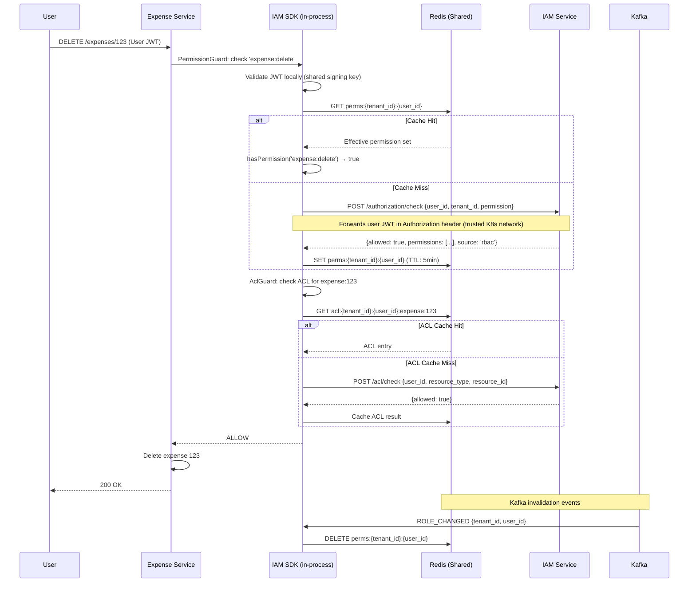

### 2.4 Predefined System Roles

| Role | Scope | Permissions | Notes |
|------|-------|-------------|-------|
| `SUPER_ADMIN` | Global | `*:*` | Seeded at bootstrap. Not tenant-bound. |
| `TENANT_ADMIN` | Tenant | `user:*`, `role:*`, `acl:*`, `tenant:read`, `tenant:write` | Full tenant management |
| `TENANT_USER` | Tenant | `user:read` (self only) | Base role for all users |
| `EXPENSE_MANAGER` | Tenant | `expense:read`, `expense:write`, `expense:delete`, `expense:approve` | Full expense management |
| `EXPENSE_VIEWER` | Tenant | `expense:read` | Read-only expense access |
| `EXPENSE_APPROVER` | Tenant | `expense:read`, `expense:approve` | Approve but not create/delete |
| `PAYROLL_MANAGER` | Tenant | `payroll:read`, `payroll:write`, `payroll:approve` | Full payroll management |
| `PAYROLL_VIEWER` | Tenant | `payroll:read` | Read-only payroll access |
| `INVOICE_MANAGER` | Tenant | `invoice:read`, `invoice:write`, `invoice:delete`, `invoice:approve` | Full invoice management |
| `INVOICE_VIEWER` | Tenant | `invoice:read` | Read-only invoice access |
| `REPORT_VIEWER` | Tenant | `report:read` | Read-only reports |
| `REPORT_MANAGER` | Tenant | `report:read`, `report:write`, `report:export` | Create/export reports |
| `WORKFLOW_MANAGER` | Tenant | `workflow:read`, `workflow:write`, `workflow:execute` | Manage workflows |
| `HR_MANAGER` | Tenant | `user:read`, `user:write`, `payroll:read` | User + payroll read access |
| `AUDITOR` | Tenant | `expense:read`, `payroll:read`, `invoice:read`, `report:read`, `audit:read` | Read-only cross-module for compliance |

---

## 3. Cache Invalidation Flow

### 3.1 Cache Invalidation Flow

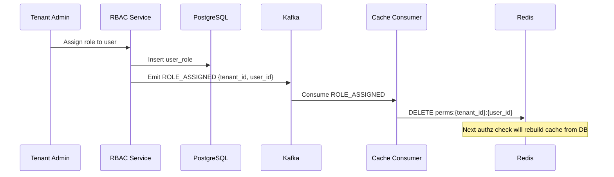

### 3.2 Kafka Topics for Cache Invalidation

| Topic | Events | Purpose |
|-------|--------|---------|
| `iam.permission.changed` | `ROLE_ASSIGNED`, `ROLE_REVOKED`, `PERMISSION_ADDED`, `PERMISSION_REMOVED` | Invalidate user permission cache |
| `iam.user.changed` | `USER_UPDATED`, `USER_DEACTIVATED` | Invalidate user profile cache |
| `iam.audit` | All auditable events | Persist to audit_logs table |

### 3.3 Cache Key Patterns

| Key Pattern | Value | TTL | Invalidation |
|-------------|-------|-----|-------------|
| `perms:{tenant_id}:{user_id}` | Set of permission strings | 5 min | Kafka event on role/permission change |
| `user:{user_id}` | User profile data | 5 min | On user update |

---

## 4. Multi-Tenant Isolation Flow

### 4.1 Tenant Isolation Flow

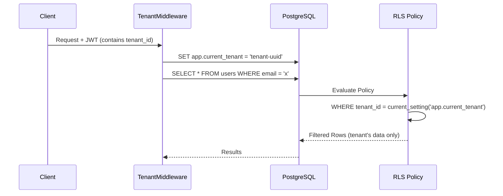

---

## 5. Service-to-Service Communication Flows

### 5.1 Cross-Service Authorization Check

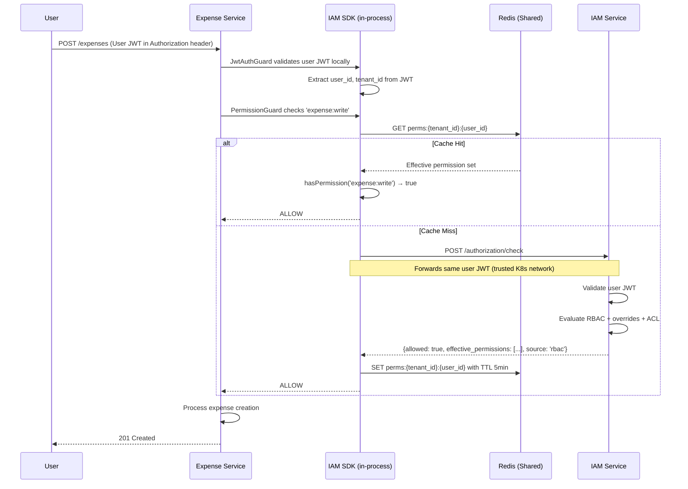

### 5.2 Async Kafka Flow

For async operations (e.g., Expense Service publishes event to Kafka for Notification Service):

1. **Producer** extracts `user_id` and `tenant_id` from JWT **before** publishing to Kafka
2. **Kafka message** carries `{ user_id, tenant_id, ... }` as metadata (not the JWT itself)
3. **Consumer** uses the embedded context directly — no JWT validation needed
4. If consumer needs to check permissions, it calls IAM's `/authorization/check` with `user_id` and `tenant_id` in the request body

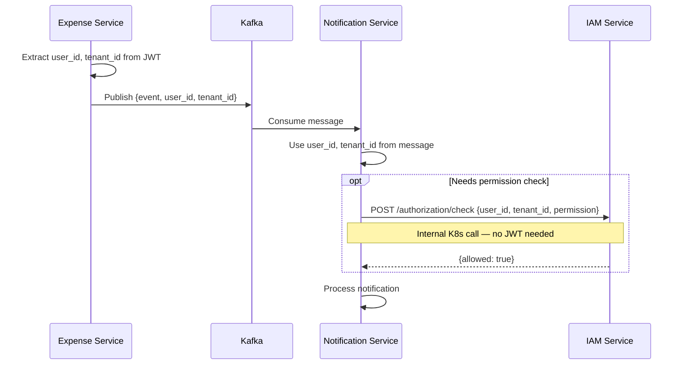

### 5.3 K8s Network Policy

```yaml
# K8s NetworkPolicy: only allow IAM traffic from known services
apiVersion: networking.k8s.io/v1
kind: NetworkPolicy
metadata:
  name: iam-allow-internal
spec:
  podSelector:
    matchLabels:
      app: iam-service
  ingress:
    - from:
        - podSelector:
            matchLabels:
              access: iam-authorized
      ports:
        - port: 3000
```

Only pods with label `access: iam-authorized` can reach IAM. External traffic goes through Ingress/API Gateway.

---

## 6. SuperAdmin & Impersonation Flow

### 6.1 Impersonation Flow

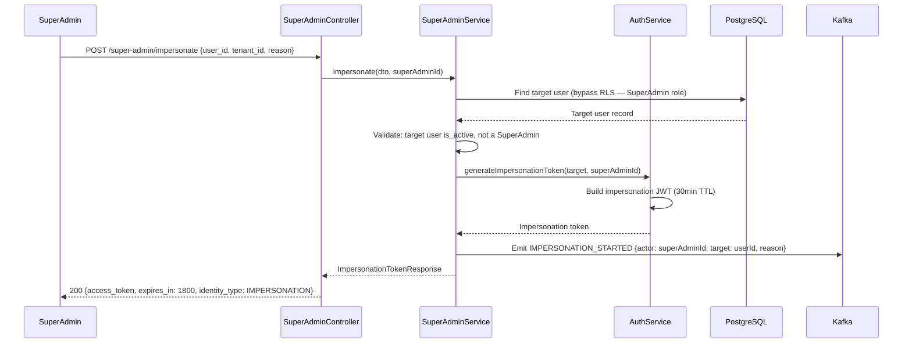

---

## 7. Audit Flow

### 7.1 Audit Pipeline

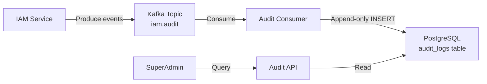

### 7.2 Auditable Events

| Category | Events |
|----------|--------|
| **Authentication** | `AUTH_LOGIN_SUCCESS`, `AUTH_LOGIN_FAILED`, `AUTH_LOGOUT`, `AUTH_TOKEN_REFRESHED` |
| **Authorization** | `AUTHZ_CHECK_ALLOWED`, `AUTHZ_CHECK_DENIED` |
| **User Management** | `USER_CREATED`, `USER_UPDATED`, `USER_ACTIVATED`, `USER_DEACTIVATED` |
| **Role Management** | `ROLE_CREATED`, `ROLE_UPDATED`, `ROLE_DELETED`, `ROLE_ASSIGNED`, `ROLE_REVOKED` |
| **Permission Management** | `PERMISSION_ADDED_TO_ROLE`, `PERMISSION_REMOVED_FROM_ROLE` |
| **ACL Management** | `ACL_CREATED`, `ACL_DELETED` |
| **Tenant Management** | `TENANT_CREATED`, `TENANT_UPDATED`, `TENANT_DEACTIVATED` |
| **Impersonation** | `IMPERSONATION_STARTED`, `IMPERSONATION_ENDED` |

### 7.3 Audit Event Schema

```json
{
  "event_id": "uuid",
  "event_type": "AUTH_LOGIN_SUCCESS",
  "timestamp": "2026-06-04T16:00:00Z",
  "actor": {
    "id": "user-uuid",
    "type": "USER",
    "email": "user@example.com"
  },
  "tenant_id": "tenant-uuid",
  "resource": {
    "type": "session",
    "id": "session-uuid"
  },
  "metadata": {
    "ip_address": "192.168.1.1",
    "user_agent": "Mozilla/5.0...",
    "correlation_id": "req-uuid"
  },
  "changes": {
    "before": {},
    "after": {}
  }
}
```

---

> **Related Documents:**
> - [02-architecture.md](./02-architecture.md) — System architecture and module structure
> - [03-database-schema.md](./03-database-schema.md) — Schema entities referenced in flows
> - [05-strategies.md](./05-strategies.md) — Why these design choices were made
> - [06-api-reference.md](./06-api-reference.md) — API endpoints for auth, RBAC, ACL, S2S
