# IAM Service — Design Document

> **Version:** 1.0.0  
> **Date:** 2026-06-04  
> **Status:** Approved for MVP Implementation  
> **Author:** Product & Architecture Team  

---

## Table of Contents

1. [Executive Summary](#1-executive-summary)
2. [Problem Statement](#2-problem-statement)
3. [Functional Requirements](#3-functional-requirements)
4. [Non-Functional Requirements](#4-non-functional-requirements)
5. [Understanding Summary](#5-understanding-summary)
6. [Assumptions](#6-assumptions)
7. [High-Level Architecture](#7-high-level-architecture)
8. [Module Structure](#8-module-structure)
9. [Multi-Tenant Isolation Strategy](#9-multi-tenant-isolation-strategy)
10. [Authentication Flow](#10-authentication-flow)
11. [Authorization Flow](#11-authorization-flow)
12. [Access Control Model](#12-access-control-model)
13. [Service-to-Service Security](#13-service-to-service-security)
14. [Data Models & Schema](#14-data-models--schema)
15. [API Design](#15-api-design)
16. [Caching Strategy](#16-caching-strategy)
17. [Audit & Compliance](#17-audit--compliance)
18. [Scalability & Reliability](#18-scalability--reliability)
19. [Security & Compliance Considerations](#19-security--compliance-considerations)
20. [Operational Concerns](#20-operational-concerns)
21. [Design Approaches Explored](#21-design-approaches-explored)
22. [Decision Log](#22-decision-log)
23. [MVP Feature Matrix](#23-mvp-feature-matrix)
24. [Future Roadmap](#24-future-roadmap)

---

## 1. Executive Summary

This document defines the architecture and design for an **enterprise-grade Identity and Access Management (IAM)** backend service. The IAM service is the central security layer for a multi-tenant SaaS platform comprising multiple microservices (Expense, Payroll, Invoice, Reporting, Workflow, Notification).

**Key characteristics:**
- **Modular Monolith** architecture in **NestJS** with clean domain boundaries
- **PostgreSQL** with Row-Level Security (RLS) for tenant isolation
- **Hierarchical RBAC** + **Resource-level ACLs** for fine-grained access control
- **JWT-based** authentication supporting 4 identity types
- **Kafka**-driven audit logging for compliance
- **Redis**-based permission caching for performance
- Designed for **thousands of tenants** and **millions of users**

---

## 2. Problem Statement

Design an enterprise-grade Access Control System for a multi-tenant microservices-based SaaS platform that supports:

- Multiple organizations (tenants) with their own users, hierarchy, roles, and policies
- Authentication and authorization for both frontend (SPA/mobile) and backend (microservices)
- Fine-grained access control with resource-level granularity
- Tenant isolation with zero data leakage
- Cross-service authorization and service-to-service communication
- Auditability and security compliance
- Scale: thousands of tenants, millions of users, high request throughput

### Platform Services Consuming IAM

| Service | Dependency on IAM |
|---------|------------------|
| User Management | Identity, tenant CRUD, hierarchy |
| Expense Management | Permission checks, resource ACLs |
| Payroll | Permission checks, service auth |
| Reporting | Cross-resource read permissions |
| Workflow | Dynamic permission evaluation |
| Notification | Service-to-service auth |
| Invoice Management | Permission checks, resource ACLs |

---

## 3. Functional Requirements

### 3.1 Authentication
| ID | Requirement | Priority |
|----|-------------|----------|
| FR-AUTH-01 | Email + password login | P0 |
| FR-AUTH-02 | JWT access token (short-lived, 15min) | P0 |
| FR-AUTH-03 | JWT refresh token (long-lived, 7d) | P0 |
| FR-AUTH-04 | Four identity types: User, Service, SuperAdmin, Impersonation | P0 |
| FR-AUTH-05 | Token revocation (logout) | P0 |
| FR-AUTH-06 | Service account authentication (client_id + client_secret) | P0 |

### 3.2 User Management
| ID | Requirement | Priority |
|----|-------------|----------|
| FR-USER-01 | User CRUD within a tenant | P0 |
| FR-USER-02 | Organization (tenant) creation and management | P0 |
| FR-USER-03 | Self-referential org hierarchy (manager_id) | P0 |
| FR-USER-04 | User activation/deactivation | P0 |
| FR-USER-05 | User profile retrieval (self) | P0 |

### 3.3 Role-Based Access Control (RBAC)
| ID | Requirement | Priority |
|----|-------------|----------|
| FR-RBAC-01 | Pre-seeded system roles (Tenant_Admin, Tenant_User) | P0 |
| FR-RBAC-02 | Tenant-specific custom role creation | P0 |
| FR-RBAC-03 | Role-to-permission mappings | P0 |
| FR-RBAC-04 | User-to-role assignments | P0 |
| FR-RBAC-05 | Time-bound role assignments with expiry | P0 |
| FR-RBAC-06 | Hierarchical permission model with wildcard inheritance | P0 |

### 3.4 Fine-Grained Authorization
| ID | Requirement | Priority |
|----|-------------|----------|
| FR-ACL-01 | Resource-level ACL support (user, resource_type, resource_id, permission) | P0 |
| FR-ACL-02 | Combined RBAC + ACL evaluation | P0 |
| FR-ACL-03 | ACL CRUD APIs | P0 |

### 3.5 Super Administration
| ID | Requirement | Priority |
|----|-------------|----------|
| FR-SA-01 | Global SuperAdmin with cross-tenant visibility | P0 |
| FR-SA-02 | Impersonation with short-lived tokens (30min max) | P0 |
| FR-SA-03 | Impersonation audit trail | P0 |

### 3.6 Service-to-Service Security
| ID | Requirement | Priority |
|----|-------------|----------|
| FR-S2S-01 | Service accounts with JWT-based machine auth | P0 |
| FR-S2S-02 | Centralized authorization check API | P0 |
| FR-S2S-03 | Service identity model (Expense, Payroll, etc.) | P0 |

### 3.7 Audit & Compliance
| ID | Requirement | Priority |
|----|-------------|----------|
| FR-AUDIT-01 | Event-driven audit logging via Kafka | P0 |
| FR-AUDIT-02 | Append-only audit log storage | P0 |
| FR-AUDIT-03 | Track: auth events, role changes, ACL changes, impersonation | P0 |

---

## 4. Non-Functional Requirements

| ID | Requirement | Target |
|----|-------------|--------|
| NFR-01 | **Availability** | 99.9% uptime |
| NFR-02 | **Latency — Auth endpoints** | p95 < 200ms |
| NFR-03 | **Latency — Authorization checks** | p95 < 50ms (cached) |
| NFR-04 | **Throughput** | 10,000 RPS sustained |
| NFR-05 | **Tenant scale** | 10,000+ tenants |
| NFR-06 | **User scale** | 10M+ users |
| NFR-07 | **Data isolation** | Zero cross-tenant data leakage |
| NFR-08 | **Token security** | Access token ≤ 15min, refresh ≤ 7d |
| NFR-09 | **Audit retention** | 90 days hot, archival policy TBD |
| NFR-10 | **Deployment** | Docker / Kubernetes (self-hosted) |
| NFR-11 | **Recovery** | RPO < 1 hour, RTO < 15 minutes |
| NFR-12 | **Password security** | bcrypt (cost factor 12) |

---

## 5. Understanding Summary

1. **What:** Enterprise-grade multi-tenant IAM backend service (Modular Monolith) providing authentication, RBAC with hierarchical permissions, resource-level ACLs, audit logging, and service-to-service security.

2. **Why:** Central security layer for a SaaS platform with multiple services. Single source of truth for identity, access control, and compliance.

3. **Who:** Consumed by both frontend apps (SPA/mobile → login, profile, token refresh) and backend microservices (authorization checks, service identity, impersonation).

4. **Tech Stack:** NestJS, PostgreSQL (RLS), Redis (caching), Kafka (audit events), TypeORM. Self-hosted (Docker/K8s).

5. **Access Control Model:** RBAC with hierarchical permissions (`resource:action` with wildcard inheritance) + centralized resource-level ACLs owned by IAM.

6. **Scope:** Full MVP — documentation + working codebase. Email+password auth only.

7. **Non-goals for MVP:** OAuth2/SSO, rate limiting, password reset, email verification, ABAC, multi-region deployment.

---

## 6. Assumptions

| ID | Assumption | Rationale |
|----|------------|-----------|
| A1 | JWT access tokens: 15min TTL, refresh tokens: 7d TTL, stored in DB | Industry standard balance of security vs. UX |
| A2 | SuperAdmin is seeded at bootstrap, not self-registered. Global scope (not per-tenant) | Security: SuperAdmin creation must be a controlled operation |
| A3 | Kafka audit events are fire-and-forget in MVP (at-least-once, no replay guarantees) | Simplicity; guaranteed delivery adds significant complexity |
| A4 | Service accounts use pre-provisioned credentials (client_id + client_secret), not mTLS | mTLS requires certificate infrastructure; overkill for MVP |
| A5 | Organizational hierarchy is a simple tree (manager_id self-reference), not a DAG | Trees cover 99% of enterprise org charts; DAGs add query complexity |
| A6 | Permission cache TTL: 5 minutes + event-driven invalidation via Kafka consumer | Balance between freshness and Redis load |
| A7 | Impersonation tokens: max 30min TTL, cannot impersonate SuperAdmin, always audited | Security: impersonation is high-risk, must be bounded |
| A8 | Audit logs stored in PostgreSQL (append-only table) for MVP | Avoids adding another data store; can migrate to time-series DB later |
| A9 | No multi-region deployment in MVP; single-region active setup | Multi-region adds extreme complexity; unnecessary for initial scale |
| A10 | TypeORM with migrations for schema management | Consistent with NestJS ecosystem; migration-based schema evolution |
| A11 | Password hashing: bcrypt with cost factor 12 | Industry standard; balance of security and performance |
| A12 | All API responses follow consistent envelope format | Developer experience for consumers |

---

## 7. High-Level Architecture

### 7.1 System Context Diagram (C4 Level 1)

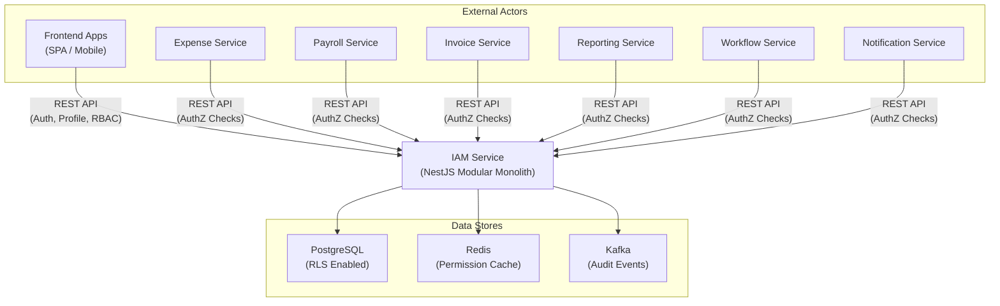

### 7.2 Container Diagram (C4 Level 2)

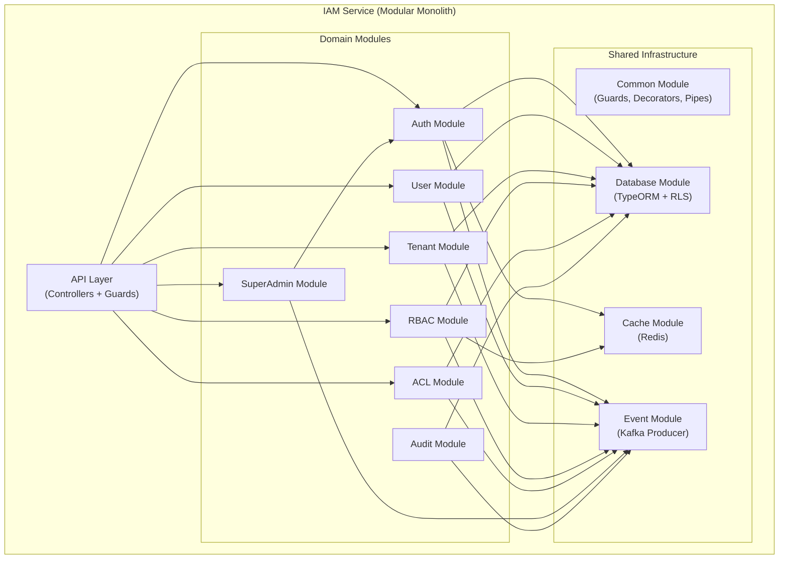

### 7.3 Request Flow Overview

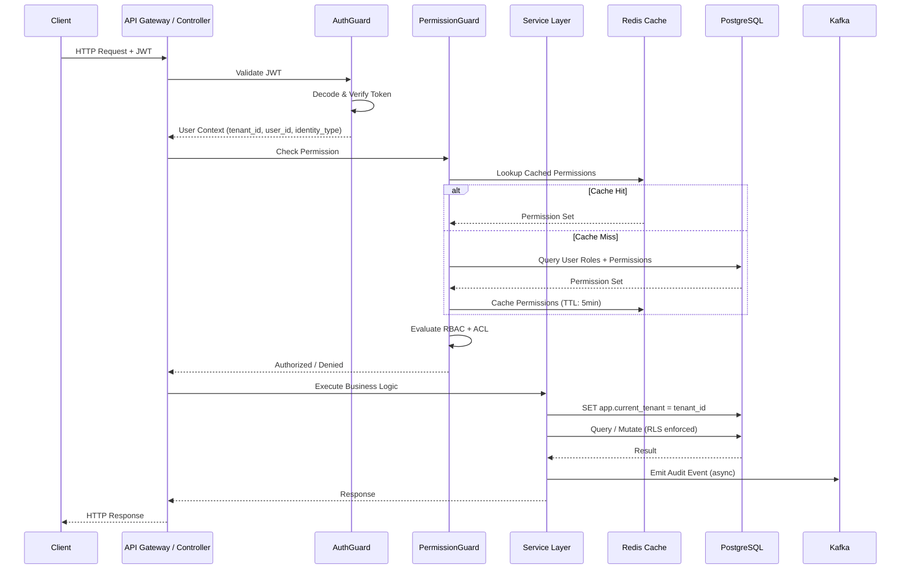

---

## 8. Module Structure

### 8.1 NestJS Module Hierarchy

```
src/
├── main.ts
├── app.module.ts                    # Root module
│
├── common/                          # Shared infrastructure
│   ├── common.module.ts
│   ├── guards/
│   │   ├── jwt-auth.guard.ts        # JWT validation
│   │   ├── permission.guard.ts      # RBAC permission check
│   │   ├── acl.guard.ts             # Resource-level ACL check
│   │   └── identity-type.guard.ts   # Identity type enforcement
│   ├── decorators/
│   │   ├── current-user.decorator.ts
│   │   ├── require-permissions.decorator.ts
│   │   ├── require-acl.decorator.ts
│   │   ├── identity-types.decorator.ts
│   │   └── public.decorator.ts
│   ├── interceptors/
│   │   ├── correlation-id.interceptor.ts
│   │   ├── audit.interceptor.ts
│   │   └── response-transform.interceptor.ts
│   ├── pipes/
│   │   └── tenant-validation.pipe.ts
│   ├── filters/
│   │   └── global-exception.filter.ts
│   ├── interfaces/
│   │   ├── jwt-payload.interface.ts
│   │   ├── request-context.interface.ts
│   │   └── paginated-response.interface.ts
│   ├── base/
│   │   ├── base.entity.ts           # Generic audited entity
│   │   ├── base-tenant.entity.ts    # Tenant-scoped entity
│   │   ├── base.repository.ts       # Generic repository
│   │   ├── base.service.ts          # Generic service
│   │   └── base.controller.ts       # Generic controller
│   ├── constants/
│   │   ├── system-roles.constant.ts
│   │   ├── system-permissions.constant.ts
│   │   └── identity-types.constant.ts
│   └── utils/
│       ├── password.util.ts
│       └── permission-matcher.util.ts
│
├── database/                        # Database infrastructure
│   ├── database.module.ts
│   ├── migrations/
│   ├── seeds/
│   │   ├── super-admin.seed.ts
│   │   ├── system-roles.seed.ts
│   │   ├── system-permissions.seed.ts
│   │   └── service-accounts.seed.ts
│   └── rls/
│       └── rls-policies.sql
│
├── cache/                           # Redis cache module
│   ├── cache.module.ts
│   └── cache.service.ts
│
├── event/                           # Kafka event module
│   ├── event.module.ts
│   ├── event.producer.ts
│   └── event.consumer.ts
│
├── modules/
│   ├── auth/                        # Authentication domain
│   │   ├── auth.module.ts
│   │   ├── auth.controller.ts
│   │   ├── auth.service.ts
│   │   ├── strategies/
│   │   │   └── jwt.strategy.ts
│   │   ├── dto/
│   │   │   ├── login.dto.ts
│   │   │   ├── refresh-token.dto.ts
│   │   │   ├── service-auth.dto.ts
│   │   │   └── token-response.dto.ts
│   │   └── entities/
│   │       └── refresh-token.entity.ts
│   │
│   ├── tenant/                      # Tenant/Organization domain
│   │   ├── tenant.module.ts
│   │   ├── tenant.controller.ts
│   │   ├── tenant.service.ts
│   │   ├── dto/
│   │   │   ├── create-tenant.dto.ts
│   │   │   └── update-tenant.dto.ts
│   │   └── entities/
│   │       └── tenant.entity.ts
│   │
│   ├── user/                        # User Management domain
│   │   ├── user.module.ts
│   │   ├── user.controller.ts
│   │   ├── user.service.ts
│   │   ├── dto/
│   │   │   ├── create-user.dto.ts
│   │   │   ├── update-user.dto.ts
│   │   │   └── user-response.dto.ts
│   │   └── entities/
│   │       └── user.entity.ts
│   │
│   ├── rbac/                        # RBAC domain
│   │   ├── rbac.module.ts
│   │   ├── controllers/
│   │   │   ├── role.controller.ts
│   │   │   ├── permission.controller.ts
│   │   │   └── assignment.controller.ts
│   │   ├── services/
│   │   │   ├── role.service.ts
│   │   │   ├── permission.service.ts
│   │   │   ├── assignment.service.ts
│   │   │   └── permission-cache.service.ts
│   │   ├── dto/
│   │   │   ├── create-role.dto.ts
│   │   │   ├── assign-role.dto.ts
│   │   │   ├── create-permission.dto.ts
│   │   │   └── assign-permission.dto.ts
│   │   └── entities/
│   │       ├── role.entity.ts
│   │       ├── permission.entity.ts
│   │       ├── role-permission.entity.ts
│   │       └── user-role.entity.ts
│   │
│   ├── acl/                         # ACL domain
│   │   ├── acl.module.ts
│   │   ├── acl.controller.ts
│   │   ├── acl.service.ts
│   │   ├── dto/
│   │   │   ├── create-acl.dto.ts
│   │   │   └── check-acl.dto.ts
│   │   └── entities/
│   │       └── resource-acl.entity.ts
│   │
│   ├── super-admin/                 # SuperAdmin domain
│   │   ├── super-admin.module.ts
│   │   ├── super-admin.controller.ts
│   │   ├── super-admin.service.ts
│   │   └── dto/
│   │       └── impersonate.dto.ts
│   │
│   └── audit/                       # Audit domain
│       ├── audit.module.ts
│       ├── audit.service.ts
│       ├── audit.consumer.ts        # Kafka consumer
│       ├── dto/
│       │   └── audit-query.dto.ts
│       └── entities/
│           └── audit-log.entity.ts
│
├── config/                          # Configuration
│   ├── app.config.ts
│   ├── database.config.ts
│   ├── jwt.config.ts
│   ├── redis.config.ts
│   └── kafka.config.ts
│
└── health/                          # Health checks
    ├── health.module.ts
    └── health.controller.ts
```

### 8.2 Module Dependency Graph

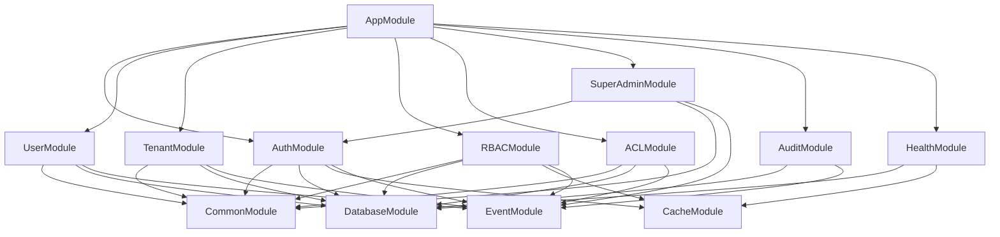

### 8.3 Clean Architecture Layers Per Module

```
Module/
├── Controller (Interface/Adapter Layer)
│   └── HTTP request/response, DTOs, decorators
│
├── Service (Application/Use Case Layer)
│   └── Business logic, orchestration, validation
│
├── Entity (Domain Layer)
│   └── Domain models, business rules, value objects
│
└── Repository (Infrastructure Layer)
    └── Data access, TypeORM queries, cache access
```

**Dependency Rule:** Dependencies flow inward only → Controller → Service → Entity. Infrastructure adapts to domain, never the reverse.

---

## 9. Multi-Tenant Isolation Strategy

### 9.1 Approach: Shared Database + PostgreSQL RLS

All tenants share a single database. Every tenant-scoped table contains a `tenant_id` column. PostgreSQL Row-Level Security (RLS) enforces isolation at the database level.

### 9.2 RLS Implementation

```sql
-- Enable RLS on tenant-scoped tables
ALTER TABLE users ENABLE ROW LEVEL SECURITY;
ALTER TABLE roles ENABLE ROW LEVEL SECURITY;
ALTER TABLE permissions ENABLE ROW LEVEL SECURITY;
ALTER TABLE user_roles ENABLE ROW LEVEL SECURITY;
ALTER TABLE role_permissions ENABLE ROW LEVEL SECURITY;
ALTER TABLE resource_acls ENABLE ROW LEVEL SECURITY;

-- Policy: tenant can only see its own data
CREATE POLICY tenant_isolation ON users
    USING (tenant_id = current_setting('app.current_tenant')::uuid);

CREATE POLICY tenant_isolation ON roles
    USING (
        is_system = true 
        OR tenant_id = current_setting('app.current_tenant')::uuid
    );

-- SuperAdmin bypass: separate DB role with BYPASSRLS
CREATE ROLE iam_superadmin BYPASSRLS;
```

### 9.3 Tenant Context Middleware

Every request sets the tenant context before any query:

```typescript
// Middleware pseudocode
@Injectable()
export class TenantContextMiddleware implements NestMiddleware {
  async use(req: Request, res: Response, next: NextFunction) {
    const tenantId = extractTenantFromJWT(req);
    
    // Set PostgreSQL session variable for RLS
    await this.dataSource.query(
      `SET app.current_tenant = '${tenantId}'`
    );
    
    next();
  }
}
```

### 9.4 Tenant Isolation Flow

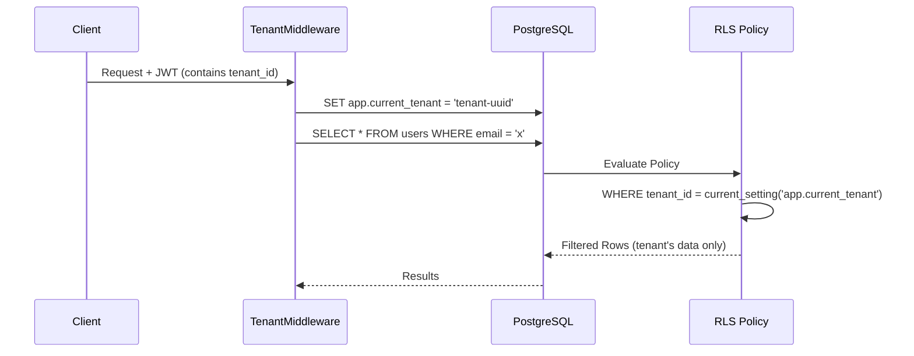

### 9.5 Tradeoffs

| Aspect | Shared DB + RLS | Schema per Tenant | DB per Tenant |
|--------|----------------|-------------------|---------------|
| **Isolation** | Row-level (strong with RLS) | Schema-level (strong) | Full (strongest) |
| **Operational Cost** | Low (1 DB) | Medium (N schemas) | High (N databases) |
| **Migration Complexity** | Low (1 migration) | High (N migrations) | Very High |
| **Query Performance** | Good (proper indexing) | Good | Best |
| **Connection Pooling** | Simple | Complex | Very Complex |
| **Cross-Tenant Queries** | Easy (SuperAdmin) | Harder | Hardest |
| **Max Tenants** | 100,000+ | ~10,000 | ~1,000 |

**Decision:** Shared DB + RLS chosen for simplicity, scalability, and operational efficiency. RLS provides strong isolation with minimal overhead.

---

## 10. Authentication Flow

### 10.1 Identity Types

| Type | Description | Token Claims | Use Case |
|------|-------------|-------------|----------|
| `USER` | Human user within a tenant | user_id, tenant_id, identity_type | Normal user operations |
| `SERVICE` | Machine identity | service_id, service_name, identity_type | Service-to-service calls |
| `SUPER_ADMIN` | Global administrator | user_id, identity_type (no tenant_id) | Cross-tenant operations |
| `IMPERSONATION` | SuperAdmin acting as user | user_id, tenant_id, impersonator_id, identity_type | Support/debugging |

### 10.2 JWT Token Structure

**Access Token Payload:**
```json
{
  "sub": "user-uuid",
  "tenant_id": "tenant-uuid",
  "identity_type": "USER",
  "iat": 1700000000,
  "exp": 1700000900
}
```

**Impersonation Token Payload:**
```json
{
  "sub": "target-user-uuid",
  "tenant_id": "target-tenant-uuid",
  "identity_type": "IMPERSONATION",
  "impersonator_id": "superadmin-uuid",
  "iat": 1700000000,
  "exp": 1700001800
}
```

**Service Token Payload:**
```json
{
  "sub": "service-uuid",
  "service_name": "expense-service",
  "identity_type": "SERVICE",
  "iat": 1700000000,
  "exp": 1700003600
}
```

### 10.3 User Login Flow

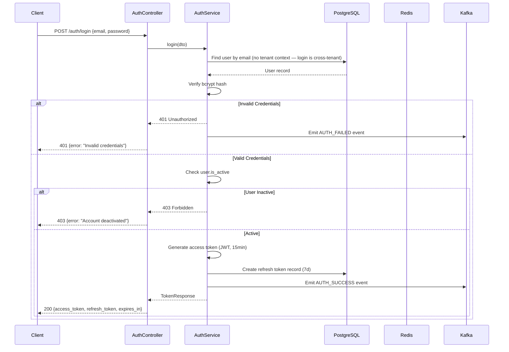

### 10.4 Token Refresh Flow

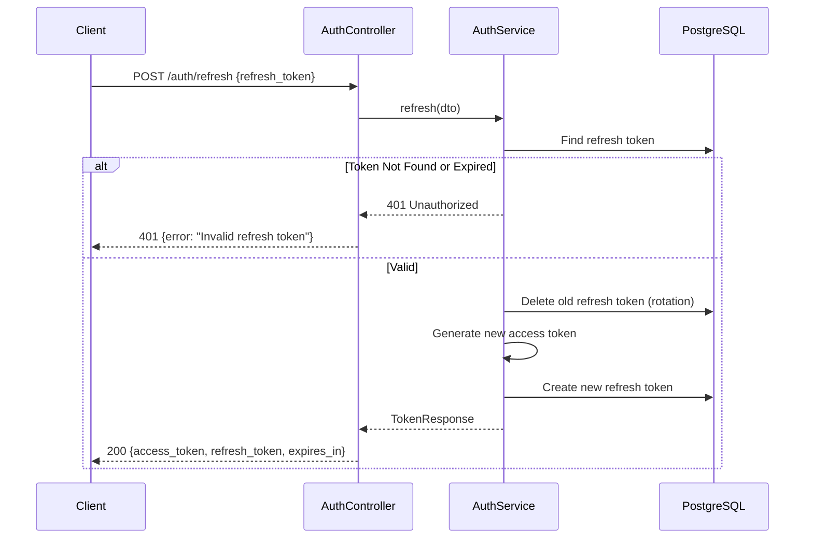

### 10.5 Logout Flow

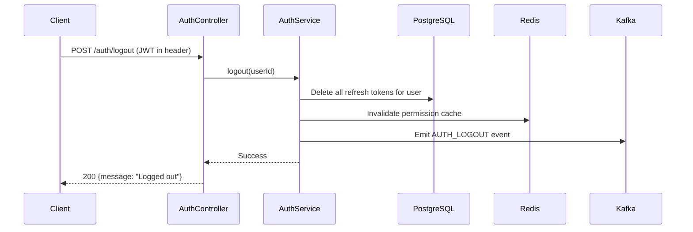

> **Note:** Access tokens are stateless JWTs and cannot be individually revoked. They expire naturally (15min). For immediate revocation, a token blacklist in Redis can be added post-MVP.

---

## 11. Authorization Flow

### 11.1 Two-Layer Authorization Model

Authorization is evaluated in two layers:

1. **Layer 1 — RBAC:** Does the user have the required permission through their assigned roles?
2. **Layer 2 — ACL:** Does the user have a specific resource-level grant for this entity?

**Evaluation Logic:** `ALLOW if (RBAC grants permission) OR (ACL grants permission)`

### 11.2 Authorization Decision Flow

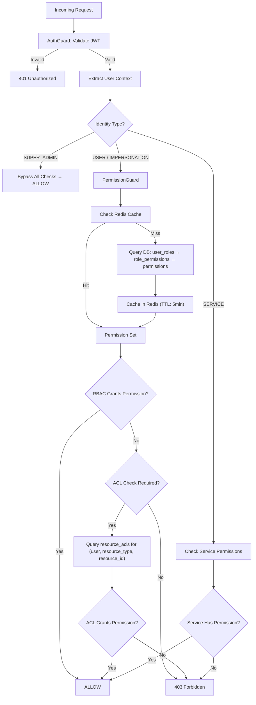

### 11.3 Permission Evaluation with Hierarchy

Permissions follow the pattern `resource:action`. Wildcards enable hierarchical inheritance.

```
Permission Hierarchy:
    *:*                    ← SuperAdmin (all resources, all actions)
    ├── expense:*          ← All expense actions
    │   ├── expense:read
    │   ├── expense:write
    │   ├── expense:delete
    │   └── expense:approve
    ├── payroll:*           ← All payroll actions
    │   ├── payroll:read
    │   └── payroll:write
    ├── user:*              ← All user management actions
    │   ├── user:read
    │   ├── user:write
    │   └── user:delete
    └── role:*              ← All role management actions
        ├── role:read
        ├── role:write
        └── role:assign
```

**Matching Algorithm (with GRANT/DENY overrides):**

```typescript
function computeEffectivePermissions(
  rolePermissions: Set<string>,    // Union of all assigned role permissions
  userGrants: Set<string>,         // User-level GRANT overrides
  userDenies: Set<string>          // User-level DENY overrides
): Set<string> {
  // Step 1: Start with role permissions
  const effective = new Set(rolePermissions);
  
  // Step 2: Add user-level GRANTs
  userGrants.forEach(p => effective.add(p));
  
  // Step 3: Remove user-level DENYs (DENY always wins)
  userDenies.forEach(p => effective.delete(p));
  
  return effective;
}

function hasPermission(
  effectivePermissions: Set<string>, 
  required: string
): boolean {
  // Direct match
  if (effectivePermissions.has(required)) return true;
  
  // Wildcard: *:* grants everything
  if (effectivePermissions.has('*:*')) return true;
  
  // Resource wildcard: expense:* grants expense:read
  const [resource, action] = required.split(':');
  if (effectivePermissions.has(`${resource}:*`)) return true;
  
  return false;
}
```

### 11.4 Authorization in Consuming Microservices (SDK Pattern)

Authorization guards and decorators do **NOT** live in the IAM service itself. They are consumed by each microservice via a shared **IAM NestJS SDK** package (`@iam/nestjs-sdk`).

#### Why Guards Live in Microservices, Not IAM

| Approach | Latency | Coupling | Resilience |
|----------|---------|----------|------------|
| Every request calls IAM API | ~20-50ms network hop | Tight — IAM is SPOF | Fails if IAM is down |
| Guards in microservice + local Redis cache | ~1-2ms cache hit | Loose — only cache misses hit IAM | Degrades gracefully |

**Decision:** Guards run locally in each microservice. They check a **shared Redis cluster** first, then fall back to IAM's `/authorization/check` API on cache miss.

#### SDK Components (`@iam/nestjs-sdk`)

```
@iam/nestjs-sdk/
├── guards/
│   ├── jwt-auth.guard.ts          # Validates JWT locally (shared secret/public key)
│   ├── permission.guard.ts        # RBAC check: Redis → IAM API fallback
│   └── acl.guard.ts               # ACL check: Redis → IAM API fallback
├── decorators/
│   ├── require-permissions.decorator.ts
│   ├── require-acl.decorator.ts
│   └── current-user.decorator.ts
├── services/
│   ├── iam-client.service.ts      # HTTP client for IAM APIs
│   └── permission-cache.service.ts # Redis cache for permissions
├── consumers/
│   └── cache-invalidation.consumer.ts  # Kafka consumer for invalidation events
└── iam.module.ts                  # NestJS module to register everything
```

#### Microservice Integration Example (Expense Service)

```typescript
// expense-service/src/app.module.ts
import { IamModule } from '@iam/nestjs-sdk';

@Module({
  imports: [
    IamModule.forRoot({
      iamBaseUrl: 'http://iam-service:3000/api/v1',
      redisHost: 'redis-cluster:6379',
      kafkaBrokers: ['kafka:9092'],
      cacheTtlSeconds: 300,
    }),
  ],
})
export class AppModule {}

// expense-service/src/expense.controller.ts
import { RequirePermissions, RequireAcl, CurrentUser } from '@iam/nestjs-sdk';

@Controller('expenses')
export class ExpenseController {
  
  @Get()
  @RequirePermissions('expense:read')
  findAll(@CurrentUser() user: UserContext) { ... }
  
  @Post()
  @RequirePermissions('expense:write')
  create(@CurrentUser() user: UserContext) { ... }
  
  @Delete(':id')
  @RequirePermissions('expense:delete')
  @RequireAcl('expense', 'delete')  // Also checks resource-level ACL
  delete(@Param('id') id: string, @CurrentUser() user: UserContext) { ... }
}
```

#### Authorization Flow in Microservice

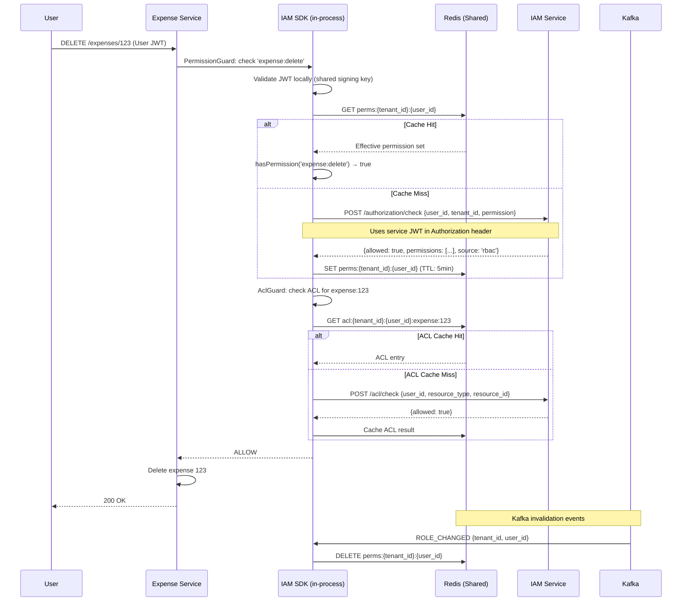

---

## 12. Access Control Model

### 12.1 RBAC Component Model

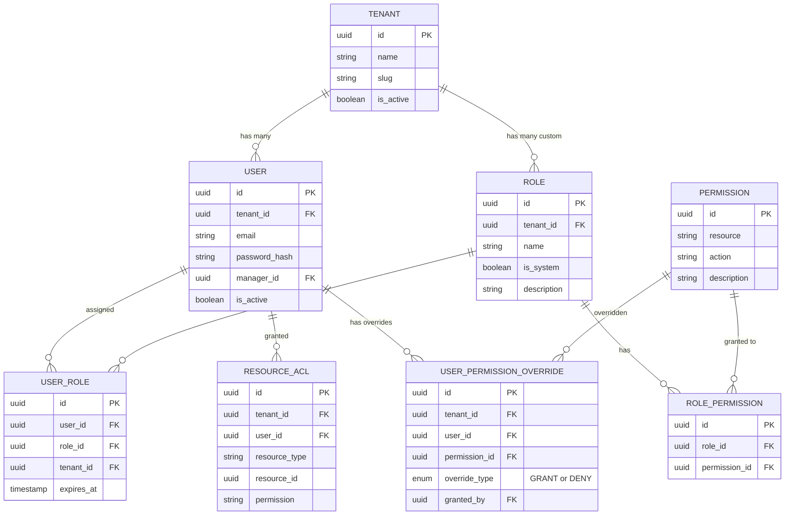

### 12.2 Predefined System Roles (Pre-Seeded)

A rich set of predefined roles makes assignment easy — admins assign roles, then optionally fine-tune with user-level permission overrides.

| Role | Scope | Permissions | Notes |
|------|-------|-------------|-------|
| `SUPER_ADMIN` | Global | `*:*` | Seeded at bootstrap. Not tenant-bound. |
| `TENANT_ADMIN` | Tenant | `user:*`, `role:*`, `acl:*`, `tenant:read`, `tenant:write` | Full tenant management |
| `TENANT_USER` | Tenant | `user:read` (self only) | Base role for all users |
| `EXPENSE_MANAGER` | Tenant | `expense:read`, `expense:write`, `expense:delete`, `expense:approve` | Full expense management |
| `EXPENSE_VIEWER` | Tenant | `expense:read` | Read-only expense access |
| `EXPENSE_APPROVER` | Tenant | `expense:read`, `expense:approve` | Approve but not create/delete |
| `PAYROLL_MANAGER` | Tenant | `payroll:read`, `payroll:write`, `payroll:approve` | Full payroll management |
| `PAYROLL_VIEWER` | Tenant | `payroll:read` | Read-only payroll access |
| `INVOICE_MANAGER` | Tenant | `invoice:read`, `invoice:write`, `invoice:delete`, `invoice:approve` | Full invoice management |
| `INVOICE_VIEWER` | Tenant | `invoice:read` | Read-only invoice access |
| `REPORT_VIEWER` | Tenant | `report:read` | Read-only reports |
| `REPORT_MANAGER` | Tenant | `report:read`, `report:write`, `report:export` | Create/export reports |
| `WORKFLOW_MANAGER` | Tenant | `workflow:read`, `workflow:write`, `workflow:execute` | Manage workflows |
| `HR_MANAGER` | Tenant | `user:read`, `user:write`, `payroll:read` | User + payroll read access |
| `AUDITOR` | Tenant | `expense:read`, `payroll:read`, `invoice:read`, `report:read`, `audit:read` | Read-only cross-module for compliance |

### 12.3 User-Level Permission Overrides (GRANT/DENY)

#### Design Decision: Roles + Overrides vs. Alternatives

| Approach | How It Works | Scalability | Flexibility | Complexity |
|----------|-------------|-------------|-------------|------------|
| **A: Assign multiple roles (additive only)** | User gets N roles, permissions are union | High | Low — can't subtract | Low |
| **B: Create unnamed per-user role** | Each customized user gets a unique role | Poor — role table explodes (M×N) | High | Medium |
| **C: Roles + User permission overrides (GRANT/DENY)** ✅ | Assign roles, then sparse overrides per user | **Highest** — overrides are sparse | **High** — add or subtract anything | Medium |

**Selected: Option C** — inspired by the AWS IAM Allow/Deny model.

#### How It Works

1. **Admin assigns predefined roles** (e.g., `EXPENSE_MANAGER`) — covers 90% of users
2. **For edge cases**, admin adds **overrides** per user:
   - `GRANT`: Add a specific permission not in any assigned role
   - `DENY`: Subtract a specific permission from assigned roles
3. **DENY always wins** over GRANT (explicit deny trumps everything)

#### Evaluation Formula

```
effective_permissions = (union_of_role_permissions ∪ user_GRANT_overrides) − user_DENY_overrides
```

#### Example: Expense Manager Without Delete

```
User: Jane Doe
Assigned Role: EXPENSE_MANAGER → {expense:read, expense:write, expense:delete, expense:approve}
Override: DENY expense:delete

Effective: {expense:read, expense:write, expense:approve}
```

#### Example: Base User With Extra Reporting Access

```
User: Bob Smith
Assigned Roles: TENANT_USER → {user:read}
Override: GRANT report:read
Override: GRANT report:export

Effective: {user:read, report:read, report:export}
```

#### API for Overrides

```
POST   /users/:id/permission-overrides    → Add GRANT or DENY override
GET    /users/:id/permission-overrides    → List user's overrides
DELETE /users/:id/permission-overrides/:overrideId → Remove override
GET    /users/:id/effective-permissions    → Computed effective permissions
```

**Request: `POST /users/:id/permission-overrides`**
```json
{
  "permission_id": "perm-uuid",
  "override_type": "DENY",
  "reason": "Temporary restriction per HR request #456"
}
```

#### Scalability Analysis

- **10M users, ~10% need overrides** = 1M override rows
- Average 2-3 overrides per customized user = ~3M rows total
- Tiny table compared to 10M users × N roles
- All computed into effective permission set and cached in Redis
- Cache invalidation on override change via Kafka

### 12.4 Custom Role Creation (Tenant-Scoped)

Tenants can still create fully custom roles when predefined ones don't suffice:

```json
{
  "name": "Custom_Expense_Auditor",
  "tenant_id": "tenant-123",
  "is_system": false,
  "permissions": [
    "expense:read",
    "expense:approve",
    "report:read"
  ]
}
```

### 12.5 Time-Bound Role Assignment

```json
{
  "user_id": "user-456",
  "role_id": "role-789",
  "tenant_id": "tenant-123",
  "expires_at": "2026-07-01T00:00:00Z"
}
```

Expired assignments are excluded from permission evaluation. A scheduled job cleans up expired records.

---

## 13. Service-to-Service Security

### 13.1 Design Decision: Dual-Header vs. Forward User JWT

#### Options Explored

| Option | How It Works | Pros | Cons |
|--------|-------------|------|------|
| **A: Forward user JWT only** | Microservice passes user's `Authorization: Bearer <user-jwt>` to IAM/other services | Simple, single token | Service has no identity — can't audit *which* service called. User JWT expires in async chains. IAM can't enforce service-level permissions. |
| **B: Dual-header (Service JWT + User context headers)** ✅ | Service JWT in `Authorization`, user context in `X-User-Id` / `X-Tenant-Id` headers | Clear service identity. User context preserved. Works in async flows. Full audit trail. | Services must be trusted to not spoof user headers — acceptable since services authenticate with their own credentials. |
| **C: Dual JWT (Service JWT + forwarded User JWT)** | Service JWT in `Authorization`, raw user JWT in `X-User-Token` | Both tokens validated | User JWT may expire mid-chain. Double validation overhead. Over-engineered. |

**Selected: Option B — Dual-Header Pattern.**

Rationale:
- Service identity is required for audit ("which service made this authorization check?")
- User JWTs have 15min TTL — in async flows (Kafka, queued jobs), they expire before processing
- Trusted headers are the industry standard pattern (Google Zanzibar, Netflix Zuul, AWS internal services)
- Decouples service authentication from user context — each concern is independent

### 13.2 Service Account Model

Each consuming microservice has a pre-provisioned **service account** with:
- `client_id` (UUID)
- `client_secret` (hashed, bcrypt)
- `service_name` (e.g., `expense-service`)
- Granted permissions (what the service can do)

### 13.3 Service Authentication Flow

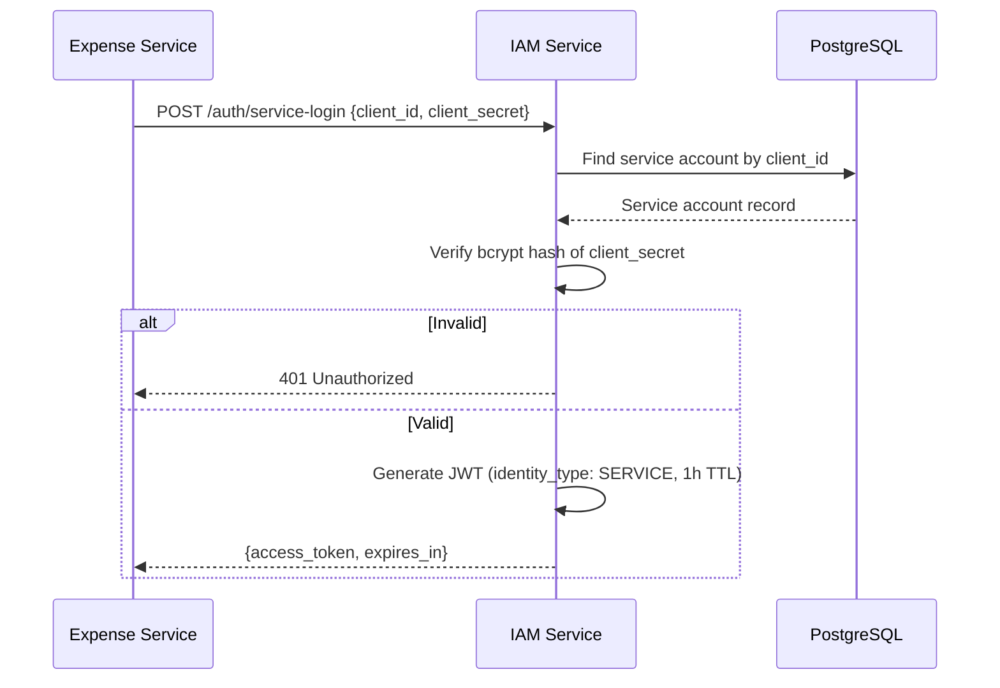

Service caches its JWT and refreshes before expiry. No refresh token for services — re-authenticate with credentials.

### 13.4 Dual-Header Pattern: Cross-Service Communication

When a microservice calls another service or IAM on behalf of a user:

**Request Headers:**
```http
Authorization: Bearer <service-jwt>     # Proves which service is calling
X-User-Id: <user-uuid>                  # User on whose behalf
X-Tenant-Id: <tenant-uuid>              # User's tenant
X-Correlation-Id: <correlation-uuid>    # Request tracing
```

**Why this is safe:**
1. The `Authorization` header authenticates the service — only known services can call IAM
2. IAM trusts `X-User-Id`/`X-Tenant-Id` because the calling service is already authenticated
3. If a service is compromised, credential rotation revokes access immediately
4. All calls are logged with both service identity and user context for audit

### 13.5 Cross-Service Authorization Check Flow

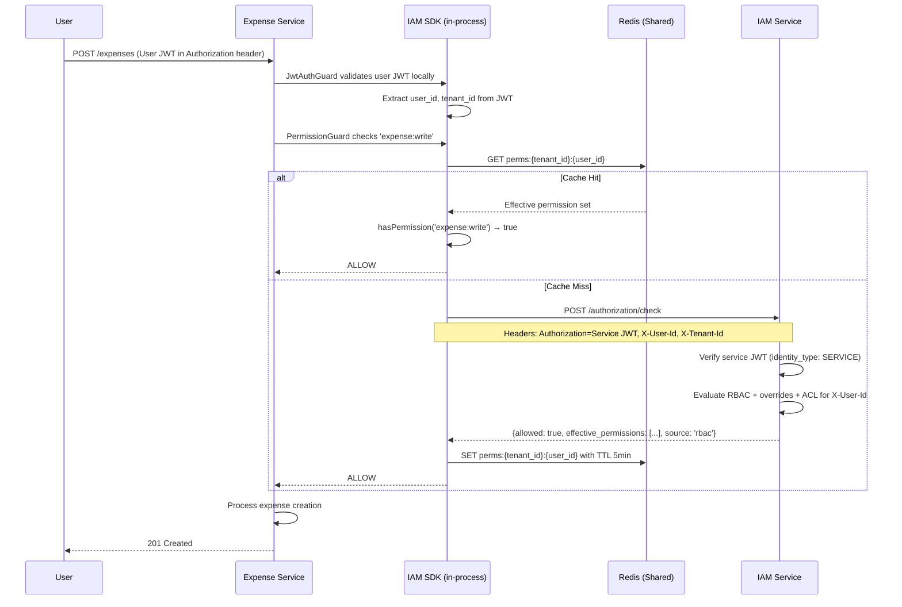

### 13.6 Service-to-Service Communication (No User Context)

For system-level operations (e.g., Notification Service sending a digest, Workflow Service running a scheduled job):

```http
Authorization: Bearer <service-jwt>     # Service identity only
X-Correlation-Id: <correlation-uuid>
# No X-User-Id — this is a system operation
```

IAM checks: does this service have the required permission? No user-level evaluation.

### 13.7 Pre-Provisioned Service Accounts

| Service | client_id | Permissions |
|---------|-----------|-------------|
| expense-service | `svc-expense-uuid` | `authorization:check`, `user:read` |
| payroll-service | `svc-payroll-uuid` | `authorization:check`, `user:read` |
| invoice-service | `svc-invoice-uuid` | `authorization:check`, `user:read` |
| reporting-service | `svc-reporting-uuid` | `authorization:check`, `user:read`, `role:read` |
| workflow-service | `svc-workflow-uuid` | `authorization:check`, `role:read`, `user:read` |
| notification-service | `svc-notification-uuid` | `authorization:check`, `user:read` |

---

## 14. Data Models & Schema

### 14.1 Entity Relationship Diagram

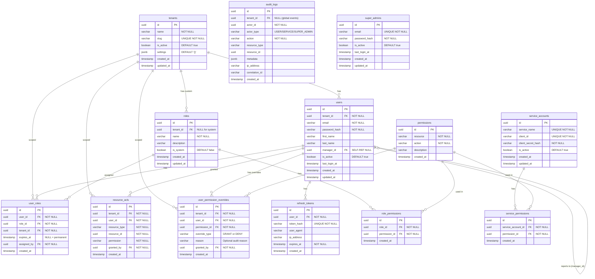

### 14.2 Key Indexes

```sql
-- Performance-critical indexes
CREATE INDEX idx_users_tenant_email ON users(tenant_id, email);
CREATE INDEX idx_users_tenant_active ON users(tenant_id, is_active);
CREATE INDEX idx_users_manager ON users(manager_id) WHERE manager_id IS NOT NULL;

CREATE INDEX idx_user_roles_user ON user_roles(user_id);
CREATE INDEX idx_user_roles_tenant_user ON user_roles(tenant_id, user_id);
CREATE INDEX idx_user_roles_expiry ON user_roles(expires_at) WHERE expires_at IS NOT NULL;

CREATE INDEX idx_role_permissions_role ON role_permissions(role_id);

CREATE INDEX idx_resource_acls_user_resource ON resource_acls(user_id, resource_type, resource_id);
CREATE INDEX idx_resource_acls_tenant ON resource_acls(tenant_id);

-- User permission overrides
CREATE INDEX idx_user_perm_overrides_user ON user_permission_overrides(user_id);
CREATE INDEX idx_user_perm_overrides_tenant_user ON user_permission_overrides(tenant_id, user_id);
CREATE UNIQUE INDEX idx_user_perm_overrides_unique ON user_permission_overrides(tenant_id, user_id, permission_id);

CREATE INDEX idx_refresh_tokens_user ON refresh_tokens(user_id);
CREATE INDEX idx_refresh_tokens_hash ON refresh_tokens(token_hash);
CREATE INDEX idx_refresh_tokens_expiry ON refresh_tokens(expires_at);

CREATE INDEX idx_audit_logs_tenant ON audit_logs(tenant_id);
CREATE INDEX idx_audit_logs_actor ON audit_logs(actor_id);
CREATE INDEX idx_audit_logs_action ON audit_logs(action);
CREATE INDEX idx_audit_logs_created ON audit_logs(created_at);
CREATE INDEX idx_audit_logs_correlation ON audit_logs(correlation_id);

CREATE UNIQUE INDEX idx_permissions_resource_action ON permissions(resource, action);
CREATE UNIQUE INDEX idx_users_email_tenant ON users(tenant_id, email);
```

### 14.3 Base Entity (Generic)

```typescript
// All entities extend this
@Entity()
export abstract class BaseEntity {
  @PrimaryGeneratedColumn('uuid')
  id: string;

  @CreateDateColumn()
  created_at: Date;

  @UpdateDateColumn()
  updated_at: Date;
}

// Tenant-scoped entities extend this
@Entity()
export abstract class BaseTenantEntity extends BaseEntity {
  @Column({ type: 'uuid' })
  tenant_id: string;

  @ManyToOne(() => TenantEntity)
  @JoinColumn({ name: 'tenant_id' })
  tenant: TenantEntity;
}
```

---

## 15. API Design

### 15.1 API Conventions

- **Base URL:** `/api/v1`
- **Auth:** Bearer JWT in `Authorization` header
- **Content-Type:** `application/json`
- **Response Envelope:**

```json
{
  "success": true,
  "data": { ... },
  "meta": {
    "timestamp": "2026-06-04T16:00:00Z",
    "correlation_id": "req-uuid"
  }
}
```

**Error Response:**

```json
{
  "success": false,
  "error": {
    "code": "FORBIDDEN",
    "message": "Insufficient permissions",
    "details": []
  },
  "meta": {
    "timestamp": "2026-06-04T16:00:00Z",
    "correlation_id": "req-uuid"
  }
}
```

### 15.2 Authentication APIs

| Method | Endpoint | Description | Auth Required |
|--------|----------|-------------|---------------|
| `POST` | `/auth/login` | User login (email + password) | No |
| `POST` | `/auth/refresh` | Refresh access token | No (uses refresh_token) |
| `POST` | `/auth/logout` | Revoke refresh tokens | Yes (User) |
| `POST` | `/auth/service-login` | Service account login | No (uses client_id + secret) |
| `GET` | `/auth/me` | Get current user profile | Yes (User) |

#### `POST /auth/login`

**Request:**
```json
{
  "email": "user@example.com",
  "password": "securePassword123"
}
```

**Response (200):**
```json
{
  "success": true,
  "data": {
    "access_token": "eyJhbGciOiJIUzI1NiIs...",
    "refresh_token": "dGhpcyBpcyBhIHJlZnJlc2g...",
    "token_type": "Bearer",
    "expires_in": 900
  }
}
```

#### `POST /auth/service-login`

**Request:**
```json
{
  "client_id": "svc-expense-uuid",
  "client_secret": "service-secret-key"
}
```

**Response (200):**
```json
{
  "success": true,
  "data": {
    "access_token": "eyJhbGciOiJIUzI1NiIs...",
    "token_type": "Bearer",
    "expires_in": 3600
  }
}
```

### 15.3 Tenant APIs

| Method | Endpoint | Description | Auth Required |
|--------|----------|-------------|---------------|
| `POST` | `/tenants` | Create a new tenant | SuperAdmin |
| `GET` | `/tenants` | List all tenants | SuperAdmin |
| `GET` | `/tenants/:id` | Get tenant details | SuperAdmin / Tenant_Admin |
| `PATCH` | `/tenants/:id` | Update tenant | SuperAdmin / Tenant_Admin |
| `DELETE` | `/tenants/:id` | Deactivate tenant | SuperAdmin |

#### `POST /tenants`

**Request:**
```json
{
  "name": "Acme Corporation",
  "slug": "acme-corp",
  "settings": {
    "max_users": 1000,
    "features": ["expense", "payroll"]
  },
  "admin_email": "admin@acme.com",
  "admin_password": "initialPassword123"
}
```

**Response (201):**
```json
{
  "success": true,
  "data": {
    "id": "tenant-uuid",
    "name": "Acme Corporation",
    "slug": "acme-corp",
    "is_active": true,
    "admin_user": {
      "id": "user-uuid",
      "email": "admin@acme.com"
    },
    "created_at": "2026-06-04T16:00:00Z"
  }
}
```

### 15.4 User Management APIs

| Method | Endpoint | Description | Auth Required |
|--------|----------|-------------|---------------|
| `POST` | `/users` | Create user in current tenant | Tenant_Admin |
| `GET` | `/users` | List users in current tenant | Tenant_Admin |
| `GET` | `/users/:id` | Get user details | Tenant_Admin / Self |
| `PATCH` | `/users/:id` | Update user | Tenant_Admin / Self (limited) |
| `PATCH` | `/users/:id/activate` | Activate user | Tenant_Admin |
| `PATCH` | `/users/:id/deactivate` | Deactivate user | Tenant_Admin |
| `GET` | `/users/:id/hierarchy` | Get user's reporting chain | Tenant_Admin |

#### `POST /users`

**Request:**
```json
{
  "email": "jane@acme.com",
  "password": "securePassword",
  "first_name": "Jane",
  "last_name": "Doe",
  "manager_id": "manager-user-uuid"
}
```

**Response (201):**
```json
{
  "success": true,
  "data": {
    "id": "new-user-uuid",
    "email": "jane@acme.com",
    "first_name": "Jane",
    "last_name": "Doe",
    "manager_id": "manager-user-uuid",
    "is_active": true,
    "tenant_id": "tenant-uuid",
    "created_at": "2026-06-04T16:00:00Z"
  }
}
```

### 15.5 RBAC APIs

| Method | Endpoint | Description | Auth Required |
|--------|----------|-------------|---------------|
| `POST` | `/roles` | Create custom role | Tenant_Admin |
| `GET` | `/roles` | List roles (system + custom) | Tenant_Admin |
| `GET` | `/roles/:id` | Get role with permissions | Tenant_Admin |
| `PATCH` | `/roles/:id` | Update custom role | Tenant_Admin |
| `DELETE` | `/roles/:id` | Delete custom role | Tenant_Admin |
| `POST` | `/roles/:id/permissions` | Assign permissions to role | Tenant_Admin |
| `DELETE` | `/roles/:id/permissions/:permissionId` | Remove permission from role | Tenant_Admin |
| `GET` | `/permissions` | List all available permissions | Tenant_Admin |
| `POST` | `/users/:id/roles` | Assign role to user | Tenant_Admin |
| `DELETE` | `/users/:id/roles/:roleId` | Remove role from user | Tenant_Admin |
| `GET` | `/users/:id/roles` | List user's roles | Tenant_Admin / Self |
| `GET` | `/users/:id/effective-permissions` | Get computed effective permissions | Tenant_Admin / Self |
| `POST` | `/users/:id/permission-overrides` | Add GRANT/DENY override | Tenant_Admin |
| `GET` | `/users/:id/permission-overrides` | List user's overrides | Tenant_Admin / Self |
| `DELETE` | `/users/:id/permission-overrides/:overrideId` | Remove override | Tenant_Admin |

#### `POST /roles`

**Request:**
```json
{
  "name": "Custom_Finance_Role",
  "description": "Custom role for finance team",
  "permissions": [
    "expense:read",
    "invoice:read",
    "report:read"
  ]
}
```

#### `POST /users/:id/roles`

**Request:**
```json
{
  "role_id": "role-uuid",
  "expires_at": "2026-12-31T23:59:59Z"
}
```

#### `POST /users/:id/permission-overrides`

**Request (DENY — subtract permission):**
```json
{
  "permission_id": "perm-expense-delete-uuid",
  "override_type": "DENY",
  "reason": "Restricted per HR policy — no expense deletion"
}
```

**Request (GRANT — add permission):**
```json
{
  "permission_id": "perm-report-export-uuid",
  "override_type": "GRANT",
  "reason": "Temporary access for Q2 audit"
}
```

#### `GET /users/:id/effective-permissions`

**Response (200):**
```json
{
  "success": true,
  "data": {
    "user_id": "user-uuid",
    "roles": [
      { "id": "role-1", "name": "EXPENSE_MANAGER", "is_system": true }
    ],
    "role_permissions": ["expense:read", "expense:write", "expense:delete", "expense:approve"],
    "overrides": [
      { "permission": "expense:delete", "type": "DENY", "reason": "HR policy" },
      { "permission": "report:read", "type": "GRANT", "reason": "Q2 audit" }
    ],
    "effective_permissions": ["expense:read", "expense:write", "expense:approve", "report:read"]
  }
}
```

### 15.6 ACL APIs

| Method | Endpoint | Description | Auth Required |
|--------|----------|-------------|---------------|
| `POST` | `/acl` | Create resource ACL | Tenant_Admin |
| `GET` | `/acl` | List ACLs (filterable) | Tenant_Admin |
| `DELETE` | `/acl/:id` | Delete ACL entry | Tenant_Admin |
| `POST` | `/acl/check` | Check resource-level access | Internal / Service |

#### `POST /acl`

**Request:**
```json
{
  "user_id": "user-uuid",
  "resource_type": "expense",
  "resource_id": "expense-uuid",
  "permission": "approve"
}
```

#### `POST /acl/check`

**Request:**
```json
{
  "user_id": "user-uuid",
  "tenant_id": "tenant-uuid",
  "resource_type": "expense",
  "resource_id": "expense-uuid",
  "permission": "approve"
}
```

**Response:**
```json
{
  "success": true,
  "data": {
    "allowed": true,
    "source": "acl",
    "evaluated_at": "2026-06-04T16:00:00Z"
  }
}
```

### 15.7 Authorization Check API (Service-to-Service)

| Method | Endpoint | Description | Auth Required |
|--------|----------|-------------|---------------|
| `POST` | `/authorization/check` | Centralized authz check | Service |
| `POST` | `/authorization/check-batch` | Batch authz check | Service |

#### `POST /authorization/check`

**Request:**
```json
{
  "user_id": "user-uuid",
  "tenant_id": "tenant-uuid",
  "permission": "expense:write",
  "resource_type": "expense",
  "resource_id": "expense-123"
}
```

**Response:**
```json
{
  "success": true,
  "data": {
    "allowed": true,
    "source": "rbac",
    "permission": "expense:write",
    "evaluated_at": "2026-06-04T16:00:00Z"
  }
}
```

#### `POST /authorization/check-batch`

**Request:**
```json
{
  "user_id": "user-uuid",
  "tenant_id": "tenant-uuid",
  "checks": [
    { "permission": "expense:read" },
    { "permission": "expense:write" },
    { "permission": "expense:approve", "resource_type": "expense", "resource_id": "exp-123" }
  ]
}
```

**Response:**
```json
{
  "success": true,
  "data": {
    "results": [
      { "permission": "expense:read", "allowed": true, "source": "rbac" },
      { "permission": "expense:write", "allowed": true, "source": "rbac" },
      { "permission": "expense:approve", "allowed": false, "source": null }
    ],
    "evaluated_at": "2026-06-04T16:00:00Z"
  }
}
```

### 15.8 SuperAdmin APIs

| Method | Endpoint | Description | Auth Required |
|--------|----------|-------------|---------------|
| `POST` | `/super-admin/impersonate` | Impersonate a user | SuperAdmin |
| `GET` | `/super-admin/tenants` | List all tenants with stats | SuperAdmin |
| `GET` | `/super-admin/tenants/:id/users` | List tenant's users | SuperAdmin |
| `GET` | `/super-admin/audit-logs` | Query global audit logs | SuperAdmin |

#### `POST /super-admin/impersonate`

**Request:**
```json
{
  "user_id": "target-user-uuid",
  "tenant_id": "target-tenant-uuid",
  "reason": "Support ticket #12345"
}
```

**Response:**
```json
{
  "success": true,
  "data": {
    "access_token": "eyJhbGciOiJIUzI1NiIs...",
    "token_type": "Bearer",
    "expires_in": 1800,
    "identity_type": "IMPERSONATION",
    "impersonating": {
      "user_id": "target-user-uuid",
      "tenant_id": "target-tenant-uuid"
    }
  }
}
```

### 15.9 Health & Observability APIs

| Method | Endpoint | Description | Auth Required |
|--------|----------|-------------|---------------|
| `GET` | `/health` | Basic health check | No |
| `GET` | `/health/ready` | Readiness check (DB, Redis, Kafka) | No |
| `GET` | `/health/live` | Liveness probe | No |

---

## 16. Caching Strategy

### 16.1 What Is Cached

| Key Pattern | Value | TTL | Invalidation |
|-------------|-------|-----|-------------|
| `perms:{tenant_id}:{user_id}` | Set of permission strings | 5 min | Kafka event on role/permission change |
| `user:{user_id}` | User profile data | 5 min | On user update |
| `svc-perms:{service_id}` | Service permission set | 15 min | On service account update |

### 16.2 Cache Invalidation Flow

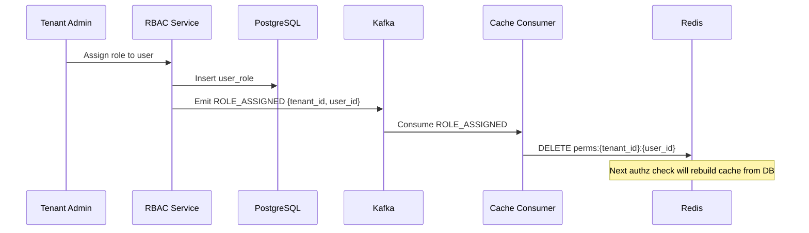

### 16.3 Kafka Topics for Cache Invalidation

| Topic | Events | Purpose |
|-------|--------|---------|
| `iam.permission.changed` | `ROLE_ASSIGNED`, `ROLE_REVOKED`, `PERMISSION_ADDED`, `PERMISSION_REMOVED` | Invalidate user permission cache |
| `iam.user.changed` | `USER_UPDATED`, `USER_DEACTIVATED` | Invalidate user profile cache |
| `iam.audit` | All auditable events | Persist to audit_logs table |

---

## 17. Audit & Compliance

### 17.1 Auditable Events

| Category | Events |
|----------|--------|
| **Authentication** | `AUTH_LOGIN_SUCCESS`, `AUTH_LOGIN_FAILED`, `AUTH_LOGOUT`, `AUTH_TOKEN_REFRESHED`, `AUTH_SERVICE_LOGIN` |
| **Authorization** | `AUTHZ_CHECK_ALLOWED`, `AUTHZ_CHECK_DENIED` |
| **User Management** | `USER_CREATED`, `USER_UPDATED`, `USER_ACTIVATED`, `USER_DEACTIVATED` |
| **Role Management** | `ROLE_CREATED`, `ROLE_UPDATED`, `ROLE_DELETED`, `ROLE_ASSIGNED`, `ROLE_REVOKED` |
| **Permission Management** | `PERMISSION_ADDED_TO_ROLE`, `PERMISSION_REMOVED_FROM_ROLE` |
| **ACL Management** | `ACL_CREATED`, `ACL_DELETED` |
| **Tenant Management** | `TENANT_CREATED`, `TENANT_UPDATED`, `TENANT_DEACTIVATED` |
| **Impersonation** | `IMPERSONATION_STARTED`, `IMPERSONATION_ENDED` |

### 17.2 Audit Event Schema

```json
{
  "event_id": "uuid",
  "event_type": "AUTH_LOGIN_SUCCESS",
  "timestamp": "2026-06-04T16:00:00Z",
  "actor": {
    "id": "user-uuid",
    "type": "USER",
    "email": "user@example.com"
  },
  "tenant_id": "tenant-uuid",
  "resource": {
    "type": "session",
    "id": "session-uuid"
  },
  "metadata": {
    "ip_address": "192.168.1.1",
    "user_agent": "Mozilla/5.0...",
    "correlation_id": "req-uuid"
  },
  "changes": {
    "before": {},
    "after": {}
  }
}
```

### 17.3 Audit Pipeline

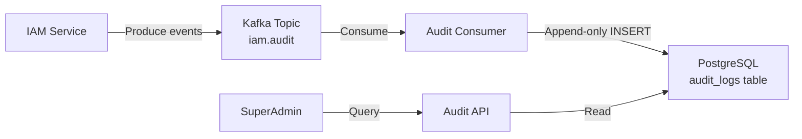

### 17.4 Audit Log Retention

- **Hot storage:** 90 days in PostgreSQL
- **Archival:** Post-MVP — export to S3/object storage
- **Table partitioning:** Partition `audit_logs` by month (`created_at`) for efficient pruning

---

## 18. Scalability & Reliability

### 18.1 Scalability Vectors

| Component | Scaling Strategy | Bottleneck | Mitigation |
|-----------|-----------------|------------|------------|
| **API Server** | Horizontal (add NestJS instances behind LB) | CPU on authz checks | Redis cache offloads DB |
| **PostgreSQL** | Vertical first, then read replicas | Write throughput on audit_logs | Kafka buffers writes; batch inserts |
| **Redis** | Redis Cluster (sharding) | Memory for 10M user permission sets | TTL-based eviction; compact permission format |
| **Kafka** | Partition by tenant_id | Consumer throughput | Multiple consumer instances |

### 18.2 Connection Pooling

```
NestJS App (N instances)
    └── TypeORM Connection Pool (per instance)
        └── PostgreSQL (max_connections = 200)
```

- Each NestJS instance manages its own TypeORM connection pool
- Pool size: 10-20 connections per instance, tuned based on instance count
- For MVP, TypeORM's built-in pooling is sufficient
- **PgBouncer:** Moved to future improvements (Phase 4) — adds value when scaling beyond 10+ app instances where connection exhaustion becomes a concern

### 18.3 Capacity Estimates

| Metric | Estimate | Notes |
|--------|----------|-------|
| **Users** | 10M | ~1000 users per tenant × 10,000 tenants |
| **Permission cache entries** | 10M keys | ~64 bytes per key, ~1KB per value = ~10GB Redis |
| **Audit events/day** | ~50M | 5 events/user/day average |
| **Auth requests/sec** | 1,000 | Login spike: 3× during business hours |
| **AuthZ requests/sec** | 10,000 | Each service request triggers 1-2 authz checks |
| **DB size (1 year)** | ~500GB | Dominated by audit_logs |

### 18.4 Reliability Patterns

| Pattern | Implementation | Purpose |
|---------|---------------|---------|
| **Circuit Breaker** | On Redis connection | Graceful degradation if cache is down (fall back to DB) |
| **Retry with Backoff** | Kafka producer | Handle transient Kafka failures |
| **Health Checks** | `/health/ready`, `/health/live` | K8s liveness/readiness probes |
| **Graceful Shutdown** | `app.enableShutdownHooks()` | Drain connections before termination |
| **Idempotent Operations** | UUID-based idempotency keys | Prevent duplicate writes on retries |

### 18.5 Failure Modes

| Failure | Impact | Mitigation |
|---------|--------|------------|
| **Redis down** | Authz latency increases (DB fallback) | Circuit breaker; permission check still works via DB |
| **Kafka down** | Audit events buffer in memory | In-memory queue with disk spillover; alert on failure |
| **PostgreSQL down** | Full service outage | Standby replica with automatic failover |
| **JWT secret compromised** | All tokens are invalid | Key rotation; short TTL limits blast radius |

---

## 19. Security & Compliance Considerations

### 19.1 Security Measures

| Area | Measure | Details |
|------|---------|---------|
| **Password Storage** | bcrypt (cost 12) | Industry standard; timing-attack resistant |
| **Token Security** | Short-lived JWTs (15min) | Limits window of compromise |
| **Refresh Token** | Stored hashed in DB, rotated on use | Single-use tokens prevent replay |
| **SQL Injection** | TypeORM parameterized queries + RLS | Defense in depth |
| **Tenant Isolation** | PostgreSQL RLS | Database-level enforcement, not app-level |
| **Impersonation** | Short-lived (30min), audited, cannot impersonate SuperAdmin | Bounded blast radius |
| **Service Secrets** | bcrypt-hashed client_secret | Never stored in plaintext |
| **CORS** | Whitelist-based | Only allow known frontend origins |
| **Helmet** | HTTP security headers | XSS, MIME sniffing, clickjacking protection |

### 19.2 Compliance Alignment

| Standard | Relevant Controls | How We Address |
|----------|------------------|----------------|
| **SOC 2** | Access control, audit logging, encryption | RBAC + ACL, append-only audit logs, bcrypt |
| **GDPR** | Data isolation, right to deletion | Tenant isolation (RLS), user deactivation |
| **ISO 27001** | Identity management, access control, audit trails | Comprehensive RBAC, hierarchical permissions, Kafka audit |

### 19.3 Threat Model

| Threat | Vector | Mitigation |
|--------|--------|------------|
| **Brute Force** | Login endpoint | Post-MVP: rate limiting. MVP: bcrypt slows attempts |
| **Token Theft** | XSS, network sniffing | Short TTL, HTTPS-only, httpOnly cookies (frontend) |
| **Privilege Escalation** | Manipulating role/permission APIs | RBAC on RBAC: only Tenant_Admin can manage roles |
| **Cross-Tenant Data Leak** | Application bug bypasses isolation | RLS enforced at DB level — app bugs can't leak |
| **Insider Threat** | SuperAdmin abuse | Impersonation audit trail, short-lived tokens |
| **Replay Attack** | Reusing refresh tokens | Refresh token rotation — each token is single-use |

---

## 20. Operational Concerns

### 20.1 Monitoring

| Metric | Type | Alert Threshold |
|--------|------|----------------|
| Auth success rate | Counter | < 95% → warning |
| Auth latency p95 | Histogram | > 500ms → warning |
| AuthZ latency p95 | Histogram | > 100ms → critical |
| Redis cache hit rate | Gauge | < 80% → warning |
| DB connection pool usage | Gauge | > 80% → warning |
| Kafka consumer lag | Gauge | > 10,000 → warning |
| Active users | Gauge | Informational |
| Failed login attempts | Counter | > 100/min per tenant → alert |

### 20.2 Structured Logging

All logs follow structured JSON format:

```json
{
  "level": "info",
  "message": "User login successful",
  "timestamp": "2026-06-04T16:00:00Z",
  "correlation_id": "req-uuid",
  "tenant_id": "tenant-uuid",
  "user_id": "user-uuid",
  "action": "AUTH_LOGIN",
  "duration_ms": 45,
  "ip_address": "192.168.1.1"
}
```

### 20.3 Correlation IDs

Every request gets a unique `X-Correlation-ID` header (generated if not provided). This ID:
- Propagated to all downstream calls
- Included in all log entries
- Stored in audit events
- Returned in error responses

### 20.4 Debugging

| Tool | Purpose |
|------|---------|
| Correlation ID tracing | Follow a request across services |
| Audit log queries | Investigate who did what, when |
| Permission evaluation endpoint | `GET /debug/evaluate-permissions?user_id=x&permission=y` (SuperAdmin only) |
| Health check endpoints | Verify connectivity to DB, Redis, Kafka |

### 20.5 Deployment Architecture

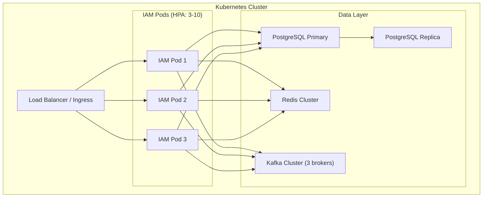

---

## 21. Design Approaches Explored

### Approach 1: Pure Modular Monolith (✅ Selected)

**Description:** Single NestJS application with well-defined domain modules. Internal module communication via NestJS dependency injection. Kafka only for async events (audit, cache invalidation).

| Aspect | Rating |
|--------|--------|
| Complexity | ⭐ Low |
| Extensibility | ⭐⭐⭐ High (modules are extractable) |
| Risk | ⭐ Low |
| Maintenance | ⭐ Easy |
| Performance | ⭐⭐⭐ High (in-process calls) |

**Pros:**
- Simple deployment (single artifact)
- No network overhead for inter-module calls
- Easy debugging and tracing
- Single transaction boundary
- Modules can be extracted to microservices later

**Cons:**
- Single point of failure (mitigated by multiple instances)
- Scaling is all-or-nothing (can't scale auth independently)
- Shared memory space (one module's leak affects all)

### Approach 2: Modular Monolith with Internal Event Bus

**Description:** Same as Approach 1, but modules communicate via an internal event bus (NestJS CQRS module) instead of direct injection. Adds eventual consistency within the monolith.

| Aspect | Rating |
|--------|--------|
| Complexity | ⭐⭐ Medium |
| Extensibility | ⭐⭐⭐ High (event-driven) |
| Risk | ⭐⭐ Medium |
| Maintenance | ⭐⭐ Moderate |

**Why not chosen:** Adds eventual consistency complexity for operations that are inherently synchronous (auth → check permission). Overkill for MVP.

### Approach 3: Microservices from Day 1

**Description:** Separate services for Auth, User Management, RBAC, Audit. Each with its own DB/schema. Communication via REST/gRPC + Kafka.

| Aspect | Rating |
|--------|--------|
| Complexity | ⭐⭐⭐ High |
| Extensibility | ⭐⭐⭐ Highest |
| Risk | ⭐⭐⭐ High |
| Maintenance | ⭐⭐⭐ Complex |

**Why not chosen:** Premature for MVP. Adds distributed transaction complexity, network latency on every auth check, and operational overhead (multiple deployments, service discovery, circuit breakers). Can evolve from Approach 1 when scale demands it.

---

## 22. Decision Log

| # | Decision | Alternatives Considered | Rationale |
|---|----------|------------------------|-----------|
| D1 | **Modular Monolith** architecture | Microservices, Event-driven monolith | Simplest to build, deploy, debug. Modules extractable later. IAM is latency-sensitive — in-process calls are critical. |
| D2 | **PostgreSQL RLS** for tenant isolation | Schema-per-tenant, DB-per-tenant | RLS scales to 100K+ tenants with minimal ops overhead. Single migration path. SuperAdmin bypass via DB role. |
| D3 | **Hierarchical permissions** with wildcards | Flat permissions, ABAC | Wildcards (`resource:*`) provide 80% of ABAC flexibility with 20% complexity. Flat permissions too rigid for enterprise use. |
| D4 | **IAM owns ACLs centrally** | Services own their ACLs, Hybrid | Central ACL = single source of truth. Services don't need ACL infrastructure. Trade-off: IAM becomes resource-aware (but only at ID level). |
| D5 | **JWT + Refresh token rotation** | Session-based, Opaque tokens + introspection | JWTs are stateless — services can validate locally. Refresh rotation prevents replay. Trade-off: can't revoke access tokens instantly (15min TTL mitigates). |
| D6 | **Redis for permission caching** | Local in-memory cache, No cache | Redis is shared across instances — consistent cache. p95 < 50ms for authz checks. Trade-off: Redis dependency (circuit breaker handles failures). |
| D7 | **Kafka for audit events** | Direct DB writes, RabbitMQ | Kafka provides durability, ordering, and decoupling. Audit writes don't block request path. Trade-off: operational overhead of Kafka cluster. |
| D8 | **bcrypt** for password hashing | Argon2, scrypt | bcrypt is battle-tested, widely supported. Cost factor 12 = ~250ms per hash (good for anti-brute-force). Trade-off: Argon2 is technically superior but less ecosystem support. |
| D9 | **TypeORM** for ORM | Prisma, MikroORM, raw SQL | TypeORM integrates natively with NestJS. Decorator-based entities align with NestJS patterns. Trade-off: TypeORM has known issues with complex queries (mitigated by raw SQL for RLS setup). |
| D10 | **Email + password only** for MVP | OAuth2/SSO, Passwordless | Minimal external dependencies. OAuth2 adds complexity (provider management, token exchange). Extension points designed but not built. |
| D11 | **Append-only audit in PostgreSQL** | Dedicated audit DB (TimescaleDB, ClickHouse) | Single data store simplifies MVP. Monthly partitioning handles growth. Trade-off: PostgreSQL not optimized for append-only analytics (post-MVP migration path). |
| D12 | **Service accounts** with client_id/secret | mTLS, API keys | Simpler than mTLS (no certificate infrastructure). Hashed secrets in DB. JWT-based service tokens. Trade-off: secrets can be leaked (rotation policy needed). |
| D13 | **No rate limiting in MVP** | Redis-based rate limiting | Reduces MVP scope. bcrypt's compute cost provides some brute-force resistance. Post-MVP: Redis sliding window rate limiter. |
| D14 | **Correlation ID via interceptor** | Middleware, Framework-level | NestJS interceptors have request/response context. Propagated via `X-Correlation-ID` header. |
| D15 | **Dual-header S2S pattern** (Service JWT + user context headers) | Forward user JWT, Dual JWT (forward both) | Service identity required for audit. User JWTs expire in async chains. Trusted headers are industry standard (Google Zanzibar, Netflix). Decouples service auth from user context. |
| D16 | **User permission overrides** (GRANT/DENY per user) | Assign multiple roles only, Create unnamed per-user role | Overrides are sparse (~10% users need them). Roles stay clean templates. DENY-wins model matches AWS IAM. Per-user roles would explode the role table. |
| D17 | **IAM SDK for microservices** (`@iam/nestjs-sdk`) | Guards in IAM only (all services call IAM), Each service reimplements guards | SDK ensures consistent guard logic. Local Redis cache gives ~1ms authz checks vs ~20-50ms API calls. Kafka invalidation keeps caches fresh. |
| D18 | **No PgBouncer in MVP** | PgBouncer from day one | TypeORM's built-in pool is sufficient for <10 instances. PgBouncer adds operational complexity. Will add in Phase 4 when scaling beyond 10+ instances. |

---

## 23. MVP Feature Matrix

| Feature | Status | Priority | Notes |
|---------|--------|----------|-------|
| Multi-tenant DB with RLS | ✅ MVP | P0 | Foundation |
| JWT auth (access + refresh) | ✅ MVP | P0 | |
| 4 identity types | ✅ MVP | P0 | User, Service, SuperAdmin, Impersonation |
| Service accounts | ✅ MVP | P0 | 6 pre-seeded services |
| User CRUD | ✅ MVP | P0 | |
| Org hierarchy (manager_id) | ✅ MVP | P0 | |
| User activate/deactivate | ✅ MVP | P0 | |
| System roles (pre-seeded, 15+ roles) | ✅ MVP | P0 | Rich predefined role library |
| Custom roles | ✅ MVP | P0 | Tenant-scoped |
| Role-permission mapping | ✅ MVP | P0 | |
| User-role assignment | ✅ MVP | P0 | |
| User permission overrides (GRANT/DENY) | ✅ MVP | P0 | Per-user add/subtract from roles |
| Time-bound roles | ✅ MVP | P0 | |
| Hierarchical permissions | ✅ MVP | P0 | Wildcard matching |
| Redis permission cache | ✅ MVP | P0 | Shared across microservices |
| Event-driven cache invalidation | ✅ MVP | P0 | Via Kafka |
| Resource-level ACLs | ✅ MVP | P0 | |
| Combined RBAC + overrides + ACL eval | ✅ MVP | P0 | |
| SuperAdmin + impersonation | ✅ MVP | P0 | |
| Service-to-service auth (dual-header) | ✅ MVP | P0 | Service JWT + user context headers |
| Centralized authz API | ✅ MVP | P0 | |
| IAM NestJS SDK (`@iam/nestjs-sdk`) | ✅ MVP | P0 | Guards, decorators, cache for microservices |
| Kafka audit logging | ✅ MVP | P0 | |
| Append-only audit storage | ✅ MVP | P0 | |
| Correlation IDs | ✅ MVP | P0 | |
| Health checks | ✅ MVP | P0 | |
| Structured logging | ✅ MVP | P0 | |
| OAuth2 / SSO | ❌ Post-MVP | P2 | Extension points designed |
| Rate limiting | ❌ Post-MVP | P1 | Redis sliding window |
| Password reset | ❌ Post-MVP | P1 | Requires email infra |
| Email verification | ❌ Post-MVP | P2 | |
| Token blacklist | ❌ Post-MVP | P1 | Redis-based |
| PgBouncer | ❌ Post-MVP | P2 | Connection pooler for 10+ instances |
| Multi-region | ❌ Post-MVP | P3 | |
| ABAC | ❌ Post-MVP | P3 | |

---

## 24. Future Roadmap

### Phase 2 — Hardening (Post-MVP)
- Rate limiting (Redis sliding window) on auth endpoints
- Token blacklist in Redis for immediate revocation
- Password reset + email verification
- MFA (TOTP/SMS)
- Account lockout after N failed attempts

### Phase 3 — Enterprise Features
- OAuth2 / SAML SSO integration
- SCIM provisioning
- ABAC policy engine
- Dynamic permission policies
- Delegated administration

### Phase 4 — Scale & Observability
- PgBouncer connection pooling (when scaling beyond 10+ app instances)
- Distributed tracing (OpenTelemetry)
- Prometheus metrics + Grafana dashboards
- Audit log archival to object storage
- Read replicas for authz check scaling
- Redis Cluster for cache scaling

### Phase 5 — Platform Evolution
- API gateway integration
- SDK/client libraries for consuming services
- Self-service tenant onboarding portal
- Multi-region deployment
- Module extraction to microservices (if scale demands)

---

## Appendix A: Environment Configuration

```yaml
# .env example
# Application
APP_PORT=3000
APP_ENV=production
APP_LOG_LEVEL=info

# PostgreSQL
DB_HOST=localhost
DB_PORT=5432
DB_NAME=iam
DB_USERNAME=iam_app
DB_PASSWORD=<secure>
DB_SSL=true

# Redis
REDIS_HOST=localhost
REDIS_PORT=6379
REDIS_PASSWORD=<secure>
REDIS_DB=0

# Kafka
KAFKA_BROKERS=localhost:9092
KAFKA_CLIENT_ID=iam-service
KAFKA_GROUP_ID=iam-consumers

# JWT
JWT_SECRET=<secure-256-bit-key>
JWT_ACCESS_TTL=900
JWT_REFRESH_TTL=604800
JWT_SERVICE_TTL=3600

# SuperAdmin (bootstrap)
SUPER_ADMIN_EMAIL=superadmin@platform.com
SUPER_ADMIN_PASSWORD=<secure>

# Impersonation
IMPERSONATION_MAX_TTL=1800
```

## Appendix B: Docker Compose (Development)

```yaml
version: '3.8'
services:
  iam:
    build: .
    ports:
      - "3000:3000"
    environment:
      - DB_HOST=postgres
      - REDIS_HOST=redis
      - KAFKA_BROKERS=kafka:9092
    depends_on:
      - postgres
      - redis
      - kafka

  postgres:
    image: postgres:16
    environment:
      POSTGRES_DB: iam
      POSTGRES_USER: iam_app
      POSTGRES_PASSWORD: devpassword
    ports:
      - "5432:5432"
    volumes:
      - pgdata:/var/lib/postgresql/data

  redis:
    image: redis:7-alpine
    ports:
      - "6379:6379"
    command: redis-server --requirepass devpassword

  zookeeper:
    image: confluentinc/cp-zookeeper:7.5.0
    environment:
      ZOOKEEPER_CLIENT_PORT: 2181

  kafka:
    image: confluentinc/cp-kafka:7.5.0
    depends_on:
      - zookeeper
    ports:
      - "9092:9092"
    environment:
      KAFKA_BROKER_ID: 1
      KAFKA_ZOOKEEPER_CONNECT: zookeeper:2181
      KAFKA_ADVERTISED_LISTENERS: PLAINTEXT://kafka:9092
      KAFKA_OFFSETS_TOPIC_REPLICATION_FACTOR: 1

volumes:
  pgdata:
```

---

> **Document Status:** Approved for MVP Implementation  
> **Next Step:** Implementation handoff — create detailed implementation plan with atomic task breakdown.
