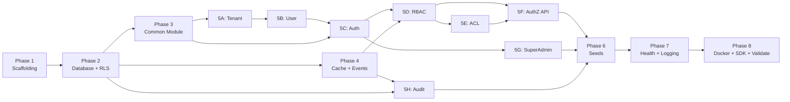

# IAM Service — Implementation Plan

> **Source:** [IAM_DESIGN_DOCUMENT.md](file:///Users/naman.sukhwani/IAM/documentation/IAM_DESIGN_DOCUMENT.md)  
> **Date:** 2026-06-04  
> **Role:** Staff Engineer  

---

## Approach

Build the IAM modular monolith bottom-up: infrastructure first (DB, Redis, Kafka), then shared common layer (base entities, guards, decorators), then domain modules in dependency order (Tenant → User → Auth → RBAC → ACL → SuperAdmin → Audit). Each phase is independently testable. Final phase: Docker Compose, seed data, and end-to-end validation.

## Scope

**In:**
- NestJS project scaffolding (Modular Monolith)
- PostgreSQL schema + RLS policies + TypeORM migrations
- Redis cache module + Kafka event module
- Common module (base entities, guards, decorators, interceptors, filters, pipes)
- 7 domain modules: Auth, Tenant, User, RBAC, ACL, SuperAdmin, Audit
- User permission overrides (GRANT/DENY)
- 15+ predefined system roles + system permissions seed
- SuperAdmin bootstrap seed
- Health check endpoints
- Docker Compose (dev environment)
- `@iam/nestjs-sdk` package structure (guards, decorators, cache, Kafka consumer)

**Out:**
- OAuth2/SSO, SAML
- Rate limiting
- Password reset / email verification
- Token blacklist
- PgBouncer
- Service accounts / SERVICE identity type (same K8s cluster = forward user JWT)
- Multi-region
- ABAC policy engine
- Frontend / UI
- CI/CD pipeline
- Production K8s manifests
- Load testing

---

## Action Items

### Phase 1 — Project Scaffolding & Configuration

- [x] **1.1** Initialize NestJS project with TypeScript strict mode
  - `npx -y @nestjs/cli new . --strict --skip-git --package-manager npm`
  - Files: `src/main.ts`, `src/app.module.ts`, `tsconfig.json`, `nest-cli.json`

- [x] **1.2** Install core dependencies
  - TypeORM: `@nestjs/typeorm`, `typeorm`, `pg`
  - Auth: `@nestjs/jwt`, `@nestjs/passport`, `passport`, `passport-jwt`, `bcrypt`
  - Redis: `@nestjs/cache-manager`, `cache-manager`, `cache-manager-redis-yet`, `redis`
  - Kafka: `@nestjs/microservices`, `kafkajs`
  - Validation: `class-validator`, `class-transformer`
  - Health: `@nestjs/terminus`
  - Config: `@nestjs/config`
  - Swagger: `@nestjs/swagger`
  - Helmet: `helmet`
  - UUID: `uuid`
  - Dev: `@types/bcrypt`, `@types/passport-jwt`, `@types/uuid`

- [x] **1.3** Create configuration module with validation
  - Files: `src/config/app.config.ts`, `database.config.ts`, `jwt.config.ts`, `redis.config.ts`, `kafka.config.ts`
  - Use `@nestjs/config` with `registerAs()` + `Joi` validation schema
  - Create `.env.example` with all env vars from design doc Appendix A

- [x] **1.4** Configure `main.ts` bootstrap
  - Enable CORS (whitelist-based)
  - Apply `helmet()`
  - Global validation pipe (`class-validator`, `whitelist: true`, `forbidNonWhitelisted: true`)
  - Global prefix `/api/v1`
  - Swagger setup at `/api/docs`
  - `enableShutdownHooks()` for graceful shutdown
  - Listen on `APP_PORT` from config

---

### Phase 2 — Database Infrastructure & RLS

- [x] **2.1** Create Database module with TypeORM
  - File: `src/database/database.module.ts`
  - TypeORM config from `database.config.ts`
  - `autoLoadEntities: true`, `synchronize: false` (use migrations)
  - Connection pool: `extra: { max: 20 }`

- [x] **2.2** Create all entity files (no business logic yet, just schema)
  - `src/common/base/base.entity.ts` — `id` (UUID), `created_at`, `updated_at`
  - `src/common/base/base-tenant.entity.ts` — extends BaseEntity + `tenant_id` FK
  - `src/modules/tenant/entities/tenant.entity.ts`
  - `src/modules/user/entities/user.entity.ts` (with `manager_id` self-ref)
  - `src/modules/auth/entities/refresh-token.entity.ts`
  - `src/modules/rbac/entities/role.entity.ts`
  - `src/modules/rbac/entities/permission.entity.ts`
  - `src/modules/rbac/entities/role-permission.entity.ts`
  - `src/modules/rbac/entities/user-role.entity.ts`
  - `src/modules/rbac/entities/user-permission-override.entity.ts`
  - `src/modules/acl/entities/resource-acl.entity.ts`
  - `src/modules/audit/entities/audit-log.entity.ts`
  - `src/modules/super-admin/entities/super-admin.entity.ts`
  - Key concern: All tenant-scoped entities extend `BaseTenantEntity`
  - Key concern: `user.email` unique per tenant (composite unique: `tenant_id + email`)
  - Key concern: `audit_logs` is append-only — no `updated_at`, no soft-delete

- [x] **2.3** Generate TypeORM migration from entities
  - Run `typeorm migration:generate`
  - File: `src/database/migrations/TIMESTAMP-InitialSchema.ts`
  - Manually add all indexes from design doc Section 14.2
  - Key concern: Add `UNIQUE` constraints on `permissions(resource, action)`, `users(tenant_id, email)`, `user_permission_overrides(tenant_id, user_id, permission_id)`

- [x] **2.4** Create RLS migration
  - File: `src/database/migrations/TIMESTAMP-EnableRLS.ts`
  - Raw SQL migration: `ALTER TABLE ... ENABLE ROW LEVEL SECURITY`
  - Create RLS policies for: `users`, `roles`, `user_roles`, `role_permissions`, `resource_acls`, `user_permission_overrides`
  - Create `iam_superadmin` DB role with `BYPASSRLS`
  - Reference: Design doc Section 9.2
  - Key concern: RLS policy on `roles` must allow `is_system = true` rows to be visible to all tenants

- [x] **2.5** Create Tenant Context Middleware
  - File: `src/common/middleware/tenant-context.middleware.ts`
  - On every request: extract `tenant_id` from JWT → `SET LOCAL app.current_tenant = '<tenant_id>'`
  - Use `SET LOCAL` (not `SET`) so it's transaction-scoped
  - Skip for: public routes, SuperAdmin routes (SuperAdmin uses BYPASSRLS role)
  - Register in `AppModule.configure()` for all routes

---

### Phase 3 — Common Infrastructure Module

- [ ] **3.1** Create interfaces and constants
  - `src/common/interfaces/jwt-payload.interface.ts` — `sub`, `tenant_id`, `identity_type`, `service_name?`, `impersonator_id?`
  - `src/common/interfaces/request-context.interface.ts` — extends Express Request with `user` field
  - `src/common/interfaces/paginated-response.interface.ts` — `data`, `total`, `page`, `limit`
  - `src/common/constants/identity-types.constant.ts` — enum: `USER`, `SUPER_ADMIN`, `IMPERSONATION`
  - `src/common/constants/system-roles.constant.ts` — enum of 15+ role names from Section 12.2
  - `src/common/constants/system-permissions.constant.ts` — all `resource:action` strings from Section 11.3
  - `src/common/constants/audit-events.constant.ts` — all event type strings from Section 17.1

- [ ] **3.2** Create utility functions
  - `src/common/utils/password.util.ts` — `hashPassword(plain)`, `comparePassword(plain, hash)` using bcrypt cost 12
  - `src/common/utils/permission-matcher.util.ts` — `computeEffectivePermissions()`, `hasPermission()` from Section 11.3
  - Write unit tests for `permission-matcher.util.ts` (critical: wildcard matching, DENY override, edge cases)

- [ ] **3.3** Create decorators
  - `src/common/decorators/public.decorator.ts` — `@Public()` marks route as no-auth
  - `src/common/decorators/current-user.decorator.ts` — `@CurrentUser()` extracts user from request
  - `src/common/decorators/require-permissions.decorator.ts` — `@RequirePermissions('expense:read')` sets metadata
  - `src/common/decorators/require-acl.decorator.ts` — `@RequireAcl('expense', 'delete')` sets metadata
  - `src/common/decorators/identity-types.decorator.ts` — `@IdentityTypes(USER, SERVICE)` restricts identity types

- [ ] **3.4** Create guards
  - `src/common/guards/jwt-auth.guard.ts` — extends `AuthGuard('jwt')`, checks `@Public()`, attaches user to request
  - `src/common/guards/identity-type.guard.ts` — reads `@IdentityTypes()` metadata, checks `req.user.identity_type`
  - `src/common/guards/permission.guard.ts` — reads `@RequirePermissions()` metadata, checks Redis cache → DB fallback, uses `hasPermission()`. SuperAdmin bypasses all checks.
  - `src/common/guards/acl.guard.ts` — reads `@RequireAcl()` metadata, queries `resource_acls` for (user_id, resource_type, resource_id). Extracts resource_id from `req.params`.
  - Register `JwtAuthGuard` as global guard in `AppModule`

- [ ] **3.5** Create interceptors, filters, pipes
  - `src/common/interceptors/correlation-id.interceptor.ts` — reads `X-Correlation-ID` header, generates UUID if missing, attaches to request context, sets response header
  - `src/common/interceptors/response-transform.interceptor.ts` — wraps all responses in `{ success, data, meta: { timestamp, correlation_id } }` envelope
  - `src/common/filters/global-exception.filter.ts` — catches all exceptions, formats into error envelope `{ success: false, error: { code, message, details } }`, logs with correlation_id
  - `src/common/pipes/tenant-validation.pipe.ts` — validates tenant_id from JWT exists in DB (cached)
  - Register all globally in `main.ts` or `AppModule`

- [ ] **3.6** Create base service and base controller (generic CRUD)
  - `src/common/base/base.service.ts` — generic `findAll(options)`, `findOne(id)`, `create(dto)`, `update(id, dto)`, `remove(id)` using TypeORM repository pattern
  - `src/common/base/base.controller.ts` — optional generic controller with `@Get()`, `@Post()`, `@Patch()`, `@Delete()` wired to base service
  - Key concern: Use TypeORM `Repository<T>` injection pattern, not custom repository classes (keeps it simple for MVP)

- [ ] **3.7** Create Common module
  - `src/common/common.module.ts` — exports all guards, decorators, utilities, interceptors
  - `@Global()` module so all domain modules can use without importing

---

### Phase 4 — Cache & Event Infrastructure

- [ ] **4.1** Create Redis cache module
  - `src/cache/cache.module.ts` — wraps `@nestjs/cache-manager` with Redis store
  - `src/cache/cache.service.ts` — typed wrapper: `getPermissions(tenantId, userId)`, `setPermissions(...)`, `invalidatePermissions(...)`, `getAcl(...)`, `setAcl(...)`, `invalidateAcl(...)`
  - Key pattern: `perms:{tenant_id}:{user_id}` → `Set<string>` (serialized as JSON array)
  - Key pattern: `acl:{tenant_id}:{user_id}:{resource_type}:{resource_id}` → `boolean`
  - TTL: 5 minutes (300s) from config

- [ ] **4.2** Create Kafka event module
  - `src/event/event.module.ts` — Kafka client microservice config
  - `src/event/event.producer.ts` — generic `emit(topic, event)` method
  - Topics: `iam.audit`, `iam.permission.changed`, `iam.user.changed`
  - `src/event/event.consumer.ts` — Kafka consumer for `iam.permission.changed` → invalidates Redis cache
  - Key concern: Producer is fire-and-forget in MVP (no ack waiting). Consumer uses `eachMessage` handler.
  - Key concern: Serialize events as JSON with `event_id`, `event_type`, `timestamp`, `payload`

---

### Phase 5 — Domain Modules (Dependency Order)

#### 5A — Tenant Module (no dependencies)

- [ ] **5A.1** Create Tenant module structure
  - `src/modules/tenant/tenant.module.ts`
  - `src/modules/tenant/tenant.controller.ts`
  - `src/modules/tenant/tenant.service.ts`
  - DTOs: `create-tenant.dto.ts`, `update-tenant.dto.ts`

- [ ] **5A.2** Implement Tenant CRUD
  - `POST /tenants` — create tenant + initial admin user (transactional). SuperAdmin only.
  - `GET /tenants` — list all tenants (SuperAdmin only, paginated)
  - `GET /tenants/:id` — get tenant details (SuperAdmin or Tenant_Admin of that tenant)
  - `PATCH /tenants/:id` — update tenant name/settings (SuperAdmin or Tenant_Admin)
  - `DELETE /tenants/:id` — soft-delete (set `is_active = false`). SuperAdmin only.
  - Key concern: Tenant creation is the ONLY operation that creates data without an existing tenant context. Must handle RLS bypass for this operation.
  - Audit: emit `TENANT_CREATED`, `TENANT_UPDATED`, `TENANT_DEACTIVATED` events

#### 5B — User Module (depends: Tenant)

- [ ] **5B.1** Create User module structure
  - `src/modules/user/user.module.ts`
  - `src/modules/user/user.controller.ts`
  - `src/modules/user/user.service.ts`
  - DTOs: `create-user.dto.ts`, `update-user.dto.ts`, `user-response.dto.ts`

- [ ] **5B.2** Implement User CRUD
  - `POST /users` — create user within current tenant. Hash password. Tenant_Admin only.
  - `GET /users` — list users in current tenant (paginated, filterable). Tenant_Admin.
  - `GET /users/:id` — get user details. Tenant_Admin or self.
  - `PATCH /users/:id` — update user. Tenant_Admin (all fields) or self (limited: first_name, last_name).
  - `PATCH /users/:id/activate` — set `is_active = true`. Tenant_Admin.
  - `PATCH /users/:id/deactivate` — set `is_active = false`, revoke all refresh tokens. Tenant_Admin.
  - `GET /users/:id/hierarchy` — recursive CTE query for reporting chain. Tenant_Admin.
  - Key concern: RLS enforces tenant isolation — service only sees users in current tenant
  - Key concern: Deactivation must cascade — invalidate Redis cache, delete refresh tokens
  - Audit: emit `USER_CREATED`, `USER_UPDATED`, `USER_ACTIVATED`, `USER_DEACTIVATED`

#### 5C — Auth Module (depends: User, Tenant)

- [ ] **5C.1** Create Auth module structure
  - `src/modules/auth/auth.module.ts`
  - `src/modules/auth/auth.controller.ts`
  - `src/modules/auth/auth.service.ts`
  - `src/modules/auth/strategies/jwt.strategy.ts`
  - DTOs: `login.dto.ts`, `refresh-token.dto.ts`, `service-auth.dto.ts`, `token-response.dto.ts`

- [ ] **5C.2** Implement JWT strategy
  - `jwt.strategy.ts` — `PassportStrategy(Strategy)`, extracts JWT from `Authorization: Bearer <token>`, validates, attaches `JwtPayload` to request
  - Register `JwtModule` with secret from config, default TTL from config
  - Key concern: Strategy must handle all 3 identity types (USER, SUPER_ADMIN, IMPERSONATION) and set `req.user` accordingly

- [ ] **5C.3** Implement User auth endpoints
  - `POST /auth/login` — find user by email (cross-tenant, no RLS), verify bcrypt hash, check `is_active`, generate access token (15min) + refresh token (7d, stored hashed in DB). Return `{ access_token, refresh_token, token_type, expires_in }`.
  - `POST /auth/refresh` — find refresh token by hash, check expiry, rotate (delete old, create new), generate new access token. Return same format.
  - `POST /auth/logout` — delete all refresh tokens for user, invalidate Redis permission cache. Requires auth.
  - `GET /auth/me` — return current user profile from JWT. Requires auth.
  - Key concern: Login is cross-tenant — must bypass RLS. Use a separate DB connection or `SET LOCAL` to empty.
  - Key concern: Refresh token stored as bcrypt hash in DB, never plaintext.
  - Audit: emit `AUTH_LOGIN_SUCCESS`, `AUTH_LOGIN_FAILED`, `AUTH_LOGOUT`, `AUTH_TOKEN_REFRESHED`

#### 5D — RBAC Module (depends: User, Tenant, Cache, Event)

- [ ] **5D.1** Create RBAC module structure
  - `src/modules/rbac/rbac.module.ts`
  - Controllers: `role.controller.ts`, `permission.controller.ts`, `assignment.controller.ts`
  - Services: `role.service.ts`, `permission.service.ts`, `assignment.service.ts`, `permission-cache.service.ts`
  - DTOs: `create-role.dto.ts`, `assign-role.dto.ts`, `create-permission.dto.ts`, `assign-permission.dto.ts`, `create-override.dto.ts`

- [ ] **5D.2** Implement Role CRUD
  - `POST /roles` — create custom role in current tenant. Tenant_Admin only. `is_system = false`.
  - `GET /roles` — list roles (system + tenant custom). Tenant_Admin.
  - `GET /roles/:id` — get role with permissions. Tenant_Admin.
  - `PATCH /roles/:id` — update custom role (name, description). Cannot modify system roles. Tenant_Admin.
  - `DELETE /roles/:id` — delete custom role. Cannot delete system roles. Check no users assigned. Tenant_Admin.
  - Audit: emit `ROLE_CREATED`, `ROLE_UPDATED`, `ROLE_DELETED`

- [ ] **5D.3** Implement Permission endpoints
  - `GET /permissions` — list all available permissions (global, not tenant-scoped). Tenant_Admin.
  - `POST /roles/:id/permissions` — assign permission(s) to role. Tenant_Admin.
  - `DELETE /roles/:id/permissions/:permissionId` — remove permission from role. Tenant_Admin.
  - Key concern: System role permissions cannot be modified by tenants
  - Audit: emit `PERMISSION_ADDED_TO_ROLE`, `PERMISSION_REMOVED_FROM_ROLE`
  - Invalidate: emit Kafka `iam.permission.changed` → invalidate all affected users' Redis cache

- [ ] **5D.4** Implement Role Assignment
  - `POST /users/:id/roles` — assign role to user with optional `expires_at`. Tenant_Admin.
  - `DELETE /users/:id/roles/:roleId` — revoke role from user. Tenant_Admin.
  - `GET /users/:id/roles` — list user's roles (including expiry status). Tenant_Admin or self.
  - Key concern: Check role belongs to same tenant or is system role
  - Key concern: Time-bound: filter out expired assignments in all queries
  - Invalidate: emit Kafka `iam.permission.changed` for affected user
  - Audit: emit `ROLE_ASSIGNED`, `ROLE_REVOKED`

- [ ] **5D.5** Implement User Permission Overrides
  - `POST /users/:id/permission-overrides` — add GRANT or DENY override. Tenant_Admin.
  - `GET /users/:id/permission-overrides` — list user's overrides. Tenant_Admin or self.
  - `DELETE /users/:id/permission-overrides/:overrideId` — remove override. Tenant_Admin.
  - `GET /users/:id/effective-permissions` — compute and return effective permissions (roles + GRANT − DENY). Tenant_Admin or self.
  - Key concern: Unique constraint on `(tenant_id, user_id, permission_id)` — can't GRANT and DENY same permission
  - Invalidate: emit Kafka `iam.permission.changed` for affected user
  - Audit: emit `PERMISSION_OVERRIDE_ADDED`, `PERMISSION_OVERRIDE_REMOVED`

- [ ] **5D.6** Implement Permission Cache Service
  - `src/modules/rbac/services/permission-cache.service.ts`
  - `getEffectivePermissions(tenantId, userId)` — Redis hit → return. Miss → query DB (user_roles → role_permissions → permissions + user_permission_overrides), compute effective set via `computeEffectivePermissions()`, cache in Redis, return.
  - `invalidateUserPermissions(tenantId, userId)` — delete Redis key
  - `invalidateTenantPermissions(tenantId)` — delete all keys matching `perms:{tenantId}:*` (use SCAN, not KEYS)
  - Wire Kafka consumer to listen on `iam.permission.changed` and call invalidation

#### 5E — ACL Module (depends: User, Tenant, Cache)

- [ ] **5E.1** Create ACL module structure
  - `src/modules/acl/acl.module.ts`
  - `src/modules/acl/acl.controller.ts`
  - `src/modules/acl/acl.service.ts`
  - DTOs: `create-acl.dto.ts`, `check-acl.dto.ts`, `acl-query.dto.ts`

- [ ] **5E.2** Implement ACL CRUD + Check
  - `POST /acl` — create resource ACL entry. Tenant_Admin.
  - `GET /acl` — list ACLs, filterable by `user_id`, `resource_type`, `resource_id`. Tenant_Admin.
  - `DELETE /acl/:id` — delete ACL entry. Tenant_Admin.
  - `POST /acl/check` — check if user has resource-level permission. Service identity only (dual-header). Returns `{ allowed, source }`.
  - Key concern: ACL check is on the hot path for consuming services. Cache result in Redis.
  - Invalidate: on ACL create/delete, invalidate Redis ACL cache for affected user+resource
  - Audit: emit `ACL_CREATED`, `ACL_DELETED`

#### 5F — Authorization Check API (depends: RBAC, ACL)

- [ ] **5F.1** Implement centralized authorization endpoint
  - Add to Auth or create separate `authorization.controller.ts`
  - `POST /authorization/check` — accepts `{ user_id, tenant_id, permission, resource_type?, resource_id? }`. Can be called with user JWT (forwarded from microservice via trusted K8s network) or with user context in body (for async flows where no JWT is available).
  - Logic: Check RBAC (via permission cache service) → if denied and resource_id present → check ACL → return `{ allowed, source, evaluated_at }`
  - `POST /authorization/check-batch` — same but accepts array of checks, returns array of results
  - Key concern: This is the highest-throughput endpoint. Must be cached. p95 < 50ms target.
  - Key concern: For async Kafka consumers, accept `user_id`/`tenant_id` in request body without JWT (internal K8s network trust).
  - Audit: optionally emit `AUTHZ_CHECK_ALLOWED` / `AUTHZ_CHECK_DENIED` (configurable, can be noisy)

#### 5G — SuperAdmin Module (depends: Auth, User, Tenant)

- [ ] **5G.1** Create SuperAdmin module structure
  - `src/modules/super-admin/super-admin.module.ts`
  - `src/modules/super-admin/super-admin.controller.ts`
  - `src/modules/super-admin/super-admin.service.ts`
  - DTOs: `impersonate.dto.ts`

- [ ] **5G.2** Implement SuperAdmin endpoints
  - `POST /super-admin/impersonate` — generate impersonation token for target user. Requires `{ user_id, tenant_id, reason }`. Max 30min TTL. Cannot impersonate another SuperAdmin. SuperAdmin only.
  - `GET /super-admin/tenants` — list all tenants with user counts (bypass RLS). SuperAdmin only.
  - `GET /super-admin/tenants/:id/users` — list users for a specific tenant (bypass RLS). SuperAdmin only.
  - `GET /super-admin/audit-logs` — query global audit logs with filters. SuperAdmin only.
  - Key concern: SuperAdmin uses separate DB role with `BYPASSRLS` privilege
  - Key concern: Impersonation token has `identity_type: IMPERSONATION` and `impersonator_id` in claims
  - Audit: emit `IMPERSONATION_STARTED` with reason, target user, impersonator

#### 5H — Audit Module (depends: Event, Database)

- [ ] **5H.1** Create Audit module structure
  - `src/modules/audit/audit.module.ts`
  - `src/modules/audit/audit.service.ts`
  - `src/modules/audit/audit.consumer.ts` (Kafka consumer)
  - DTOs: `audit-query.dto.ts`

- [ ] **5H.2** Implement Audit consumer and storage
  - Kafka consumer listens on `iam.audit` topic
  - On each message: deserialize → INSERT into `audit_logs` table (append-only)
  - Key concern: Append-only — no UPDATE, no DELETE on this table
  - Key concern: Batch inserts for performance (buffer up to 100 events or 1s, whichever first)

- [ ] **5H.3** Implement Audit query API
  - `GET /super-admin/audit-logs` — paginated query with filters: `tenant_id`, `actor_id`, `action`, `resource_type`, `date_from`, `date_to`, `correlation_id`
  - SuperAdmin only (uses BYPASSRLS)
  - Key concern: Ensure indexes cover common query patterns (see Section 14.2)

---

### Phase 6 — Seed Data & Bootstrap

- [ ] **6.1** Create system permissions seed
  - File: `src/database/seeds/system-permissions.seed.ts`
  - Seed all `resource:action` permissions from Section 11.3 + wildcard `*:*`
  - Resources: `expense`, `payroll`, `invoice`, `report`, `workflow`, `notification`, `user`, `role`, `acl`, `tenant`, `audit`
  - Actions per resource: `read`, `write`, `delete`, `approve`, `export`, `execute`, `assign` (where applicable)
  - Idempotent: check existence before insert

- [ ] **6.2** Create system roles seed
  - File: `src/database/seeds/system-roles.seed.ts`
  - Seed all 15+ roles from Section 12.2 with their permission mappings
  - `is_system = true`, `tenant_id = NULL`
  - Idempotent: upsert pattern

- [ ] **6.3** Create SuperAdmin seed
  - File: `src/database/seeds/super-admin.seed.ts`
  - Create SuperAdmin user from `SUPER_ADMIN_EMAIL` / `SUPER_ADMIN_PASSWORD` env vars
  - Hash password with bcrypt
  - Idempotent: skip if exists

- [ ] **6.4** Create seed runner
  - File: `src/database/seeds/seed.runner.ts`
  - Run: permissions → roles → role_permissions → super_admin
  - Create npm script: `"seed": "ts-node src/database/seeds/seed.runner.ts"`

---

### Phase 7 — Health Checks & Observability

- [ ] **7.1** Create Health module
  - `src/health/health.module.ts`
  - `src/health/health.controller.ts`
  - `GET /health` — basic `{ status: 'ok' }`
  - `GET /health/ready` — checks PostgreSQL, Redis, Kafka connectivity via `@nestjs/terminus`
  - `GET /health/live` — lightweight liveness probe (always 200 if process running)
  - No auth required on health endpoints (`@Public()`)

- [ ] **7.2** Add structured logging
  - Configure NestJS logger with JSON format
  - Include `correlation_id`, `tenant_id`, `user_id`, `action`, `duration_ms` in all log lines
  - Create `src/common/interceptors/logging.interceptor.ts` — logs request/response with timing

---

### Phase 8 — Docker, SDK & Validation

- [ ] **8.1** Create Docker Compose for development
  - File: `docker-compose.yml`
  - Services: `iam` (NestJS app), `postgres` (16), `redis` (7-alpine), `zookeeper`, `kafka`
  - Reference: Design doc Appendix B
  - File: `Dockerfile` — multi-stage build (builder + production)
  - File: `.dockerignore`

- [ ] **8.2** Create `@iam/nestjs-sdk` package structure
  - Directory: `packages/iam-sdk/`
  - Files: `package.json`, `tsconfig.json`, `src/index.ts`
  - Copy guards (`jwt-auth.guard.ts`, `permission.guard.ts`, `acl.guard.ts`) adapted for SDK use
  - Copy decorators (`require-permissions`, `require-acl`, `current-user`)
  - Create `iam-client.service.ts` — HTTP client wrapping IAM API calls
  - Create `permission-cache.service.ts` — Redis cache wrapper
  - Create `cache-invalidation.consumer.ts` — Kafka consumer for `iam.permission.changed`
  - Create `iam.module.ts` — `IamModule.forRoot(options)` dynamic module
  - Key concern: SDK is a separate package. In monorepo, use npm workspaces or publish to private registry.

- [ ] **8.3** Create README.md
  - Project overview, architecture summary
  - Prerequisites, setup instructions
  - API documentation link (Swagger at `/api/docs`)
  - Environment configuration reference
  - Docker Compose instructions
  - Seed data instructions
  - SDK usage examples

- [ ] **8.4** End-to-end validation checklist
  - [ ] Start Docker Compose (`docker-compose up -d`)
  - [ ] Run migrations (`npm run migration:run`)
  - [ ] Run seeds (`npm run seed`)
  - [ ] SuperAdmin login → get JWT
  - [ ] Create tenant → verify tenant + admin user created
  - [ ] Login as tenant admin → get JWT
  - [ ] Create users within tenant → verify RLS isolation
  - [ ] Create custom role with permissions
  - [ ] Assign role to user → verify Redis cache populated
  - [ ] Add permission override (DENY) → verify effective permissions
  - [ ] Call `/authorization/check` with forwarded user JWT → verify RBAC evaluation
  - [ ] Create ACL entry → verify resource-level check works
  - [ ] Impersonate user → verify short-lived token with correct claims
  - [ ] Verify audit logs in DB (Kafka → consumer → PostgreSQL)
  - [ ] Verify health endpoints respond correctly
  - [ ] Verify cross-tenant isolation (Tenant A cannot see Tenant B data)

---

## Dependency Graph (Phases)

## Open Questions

- **JWT signing algorithm:** HS256 (symmetric, simpler) or RS256 (asymmetric, SDK can validate without shared secret)? RS256 recommended for SDK pattern — microservices validate with public key, only IAM holds private key.
- **Kafka partitioning:** Partition audit topic by `tenant_id` for ordering guarantees within tenant? Or use `event_id` as key?
- **Expired role cleanup:** Cron job interval for cleaning up expired `user_roles` entries — every hour? daily?
