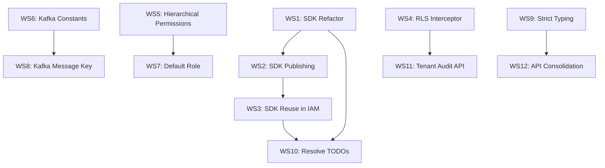

# IAM Service — Refactoring & Hardening Plan

> **12 workstreams**, ordered by dependency. Each workstream has atomic, verb-first action items.

---

## Workstream 1: SDK Refactoring — Remove Cache Ownership

**Approach**: Strip cache-invalidation and cache-setup from `@iam/nestjs-sdk`. SDK becomes a thin **read-only authz client**: check Redis first → fallback to IAM HTTP. All cache write/invalidation stays in IAM service.

### Scope
- **In**: Remove [cache-invalidation.consumer.ts](file:///Users/naman.sukhwani/IAM/packages/iam-sdk/src/cache-invalidation.consumer.ts), simplify [permission-cache.service.ts](file:///Users/naman.sukhwani/IAM/packages/iam-sdk/src/permission-cache.service.ts) to read-only, remove `CacheInvalidationConsumer` from [iam.module.ts](file:///Users/naman.sukhwani/IAM/packages/iam-sdk/src/iam.module.ts)
- **Out**: IAM service cache logic (already exists in [cache.service.ts](file:///Users/naman.sukhwani/IAM/src/cache/cache.service.ts) + [event.consumer.ts](file:///Users/naman.sukhwani/IAM/src/event/event.consumer.ts))

### Action Items

- [ ] **1.1** Delete `packages/iam-sdk/src/cache-invalidation.consumer.ts` — SDK should never consume Kafka events
- [ ] **1.2** Refactor `PermissionCacheService` → `IamAuthzService` — single `isAllowed()` method: read from Redis (shared Redis, key format `authz:{tenantId}:{userId}:{permission}:{resourceType}:{resourceId}`), if miss → call `IamClientService.checkAuthorization()`, **do NOT write back to cache** (IAM service owns writes)
- [ ] **1.3** Update `IamModule.forRoot()` options to accept `redisUrl` alongside `iamUrl`. Use `ioredis` directly (not `cache-manager`) for read-only gets. Remove `@nestjs/cache-manager` dep from SDK `package.json`
- [ ] **1.4** Remove `CacheInvalidationConsumer` from `IamModule` controllers array and `PermissionCacheService` from providers — replace with new `IamAuthzService`
- [ ] **1.5** Update SDK [index.ts](file:///Users/naman.sukhwani/IAM/packages/iam-sdk/src/index.ts) exports — remove `PermissionCacheService`, export `IamAuthzService`
- [ ] **1.6** Ensure IAM service [authorization.service.ts](file:///Users/naman.sukhwani/IAM/src/modules/authorization/authorization.service.ts) writes authz results to Redis with same key format SDK reads
- [ ] **1.7** Ensure IAM service [event.consumer.ts](file:///Users/naman.sukhwani/IAM/src/event/event.consumer.ts) handles all cache invalidation (already does via `CacheService.invalidatePermissions`)

> [!IMPORTANT]
> SDK key format must match IAM service key format exactly. Define key builders in a shared constant.

---

## Workstream 2: SDK Publishing & Local npm link

**Approach**: Document and configure SDK for local development via `npm link`, enabling other microservices to consume it without publishing to a registry.

### Action Items

- [ ] **2.1** Add `"prepare": "npm run build"` script to [packages/iam-sdk/package.json](file:///Users/naman.sukhwani/IAM/packages/iam-sdk/package.json)
- [ ] **2.2** Add `"files": ["dist"]` field to SDK `package.json` so only compiled output ships
- [ ] **2.3** Ensure `tsconfig.json` in SDK has `"declaration": true`, `"outDir": "./dist"`, `"declarationMap": true`
- [ ] **2.4** Create `packages/iam-sdk/README.md` with local dev workflow:
  ```bash
  # In SDK directory
  cd packages/iam-sdk && npm run build && npm link
  
  # In consumer microservice
  npm link @iam/nestjs-sdk
  
  # In consumer app.module.ts
  import { IamModule } from '@iam/nestjs-sdk';
  IamModule.forRoot({ iamUrl: 'http://localhost:3000', redisUrl: 'redis://localhost:6379' })
  ```
- [ ] **2.5** Add npm workspace config to root `package.json`:
  ```json
  "workspaces": ["packages/*"]
  ```
  This lets IAM service itself consume the SDK via workspace resolution

---

## Workstream 3: SDK Reuse Inside IAM — Deduplicate Decorators & Guards

**Approach**: IAM service has duplicated decorators/guards in `src/common/decorators/` and `src/common/guards/` that are carbon copies of SDK's. Import from SDK instead.

### Duplicated Files (SDK ↔ IAM)

| SDK | IAM | Status |
|-----|-----|--------|
| `decorators/require-permissions.decorator.ts` | `common/decorators/require-permissions.decorator.ts` | Duplicate |
| `decorators/require-acl.decorator.ts` | `common/decorators/require-acl.decorator.ts` | Duplicate |
| `decorators/current-user.decorator.ts` | `common/decorators/current-user.decorator.ts` | Duplicate |
| `decorators/identity-types.decorator.ts` | `common/decorators/identity-types.decorator.ts` | Duplicate |
| `decorators/public.decorator.ts` | `common/decorators/public.decorator.ts` | Duplicate |
| `guards/permission.guard.ts` | `common/guards/permission.guard.ts` | Duplicate |
| `guards/acl.guard.ts` | `common/guards/acl.guard.ts` | Duplicate |
| `guards/jwt-auth.guard.ts` | `common/guards/jwt-auth.guard.ts` | Duplicate |
| `guards/identity-type.guard.ts` | `common/guards/identity-type.guard.ts` | Duplicate |

### Action Items

- [ ] **3.1** Configure npm workspace (from 2.5) so IAM service resolves `@iam/nestjs-sdk` from `packages/iam-sdk`
- [ ] **3.2** Delete IAM's `src/common/decorators/{require-permissions,require-acl,current-user,identity-types,public}.decorator.ts`
- [ ] **3.3** Delete IAM's `src/common/guards/{permission,acl,jwt-auth,identity-type}.guard.ts`
- [ ] **3.4** Update all imports across IAM modules (`user.controller.ts`, `tenant.controller.ts`, `rbac/**`, `acl/**`, `super-admin/**`, `auth/**`) to import from `@iam/nestjs-sdk`
- [ ] **3.5** For IAM-internal guards that need DB access (permission guard needs `OverrideService`), create IAM-specific guard subclass in `src/common/guards/iam-permission.guard.ts` that extends SDK's guard and injects local services
- [ ] **3.6** Update `CommonModule` providers to use IAM-specific guard subclasses via `APP_GUARD` — SDK guards remain generic for consumer services
- [ ] **3.7** Verify all decorator metadata keys (`PERMISSIONS_KEY`, `ACL_KEY`, etc.) are exported from SDK and consumed correctly

---

## Workstream 4: RLS Tenant Isolation via Interceptor

**Approach**: Create a `TenantTransactionInterceptor` that wraps each request in a DB transaction, sets `app.current_tenant_id` via `set_config`, and commits/rolls back. Super-admin requests bypass RLS.

### Action Items

- [x] **4.1** Create `src/common/interceptors/tenant-transaction.interceptor.ts`:
  ```typescript
  @Injectable()
  export class TenantTransactionInterceptor implements NestInterceptor {
    constructor(private readonly dataSource: DataSource) {}
    
    async intercept(context: ExecutionContext, next: CallHandler): Observable<any> {
      const request = context.switchToHttp().getRequest<RequestContext>();
      const user = request.user;
      const tenantId = user?.tenant_id;
      const isSuperAdmin = user?.identity_type === IdentityType.SUPER_ADMIN;
      
      const queryRunner = this.dataSource.createQueryRunner();
      await queryRunner.connect();
      await queryRunner.startTransaction();
      
      if (tenantId && !isSuperAdmin) {
        await queryRunner.query(
          `SELECT set_config('app.current_tenant_id', $1, true);`,
          [tenantId]
        );
      }
      
      // Attach manager to request for downstream use
      request.entityManager = queryRunner.manager;
      
      return next.handle().pipe(
        tap(async () => await queryRunner.commitTransaction()),
        catchError(async (err) => {
          await queryRunner.rollbackTransaction();
          throw err;
        }),
        finalize(async () => await queryRunner.release()),
      );
    }
  }
  ```
- [x] **4.2** Extend `RequestContext` interface to include `entityManager?: EntityManager`
- [x] **4.3** Create PostgreSQL RLS policies (migration file) for all tenant-scoped tables (`users`, `roles`, `user_roles`, `permissions`, `acl_entries`, `audit_logs`, etc.):
  ```sql
  ALTER TABLE users ENABLE ROW LEVEL SECURITY;
  CREATE POLICY tenant_isolation ON users
    USING (tenant_id = current_setting('app.current_tenant_id', true)::uuid);
  ```
- [x] **4.4** Register interceptor globally in `AppModule` via `APP_INTERCEPTOR`, **after** JwtAuthGuard runs (interceptors run after guards in Nest)
- [x] **4.5** Ensure super-admin routes (in [super-admin.controller.ts](file:///Users/naman.sukhwani/IAM/src/modules/super-admin/super-admin.controller.ts)) bypass RLS — interceptor skips `set_config` when `identity_type === SUPER_ADMIN`
- [x] **4.6** Ensure tenant creation route bypasses RLS — mark with `@Public()` or check `!tenantId` before setting config
- [x] **4.7** Update services to use `request.entityManager` (from interceptor) instead of injected repositories for tenant-scoped queries. Create a `@InjectTenantManager()` decorator or use `REQUEST` scope
- [x] **4.8** Write integration test: create 2 tenants, verify user queries are isolated

> [!WARNING]
> Services using `@InjectRepository` bypass the transaction manager. Refactor services to accept `EntityManager` from request context for RLS enforcement.

---

## Workstream 5: Nested Hierarchical Permissions for Expense Service

**Approach**: Redesign permissions from flat `resource:action` to hierarchical `service.resource.action` with wildcard matching at any level. Seed expense service permissions.

### Permission Format
```
service.resource.sub-resource.action
```
Examples: `expense.departments.create`, `expense.claims.*.read`, `expense.*.*` (all expense perms)

### Permission Tree for Expense Service

```
expense
├── departments
│   ├── create    → POST   /api/v1/departments
│   ├── list      → GET    /api/v1/departments
│   ├── read      → GET    /api/v1/departments/:id
│   ├── update    → PATCH  /api/v1/departments/:id
│   └── budget
│       └── update → PATCH /api/v1/departments/:id/budget
├── categories
│   ├── create    → POST   /api/v1/categories
│   ├── list      → GET    /api/v1/categories
│   └── update    → PATCH  /api/v1/categories/:id
├── exchange-rates
│   ├── create    → POST   /api/v1/exchange-rates
│   ├── list      → GET    /api/v1/exchange-rates
│   └── delete    → DELETE /api/v1/exchange-rates/:id
├── settings
│   ├── read      → GET    /api/v1/settings
│   └── update    → PATCH  /api/v1/settings/:key
├── expenses
│   ├── create    → POST   /api/v1/expenses
│   ├── list      → GET    /api/v1/expenses
│   ├── read      → GET    /api/v1/expenses/:id
│   ├── update    → PATCH  /api/v1/expenses/:id
│   ├── delete    → DELETE /api/v1/expenses/:id
│   └── receipt
│       ├── upload   → POST   /api/v1/expenses/:id/receipt
│       ├── download → GET    /api/v1/expenses/:id/receipt
│       └── delete   → DELETE /api/v1/expenses/:id/receipt
├── claims
│   ├── create    → POST   /api/v1/claims
│   ├── list      → GET    /api/v1/claims
│   ├── read      → GET    /api/v1/claims/:id
│   ├── update    → PATCH  /api/v1/claims/:id
│   ├── submit    → POST   /api/v1/claims/:id/submit
│   └── withdraw  → POST   /api/v1/claims/:id/withdraw
└── approvals
    ├── pending.list   → GET  /api/v1/approvals/pending
    ├── history.list   → GET  /api/v1/approvals/history
    ├── claims.read    → GET  /api/v1/approvals/claims/:id
    ├── claims.approve → POST /api/v1/approvals/claims/:id/approve
    ├── claims.partial-approve → POST /api/v1/approvals/claims/:id/partial-approve
    └── claims.reject  → POST /api/v1/approvals/claims/:id/reject
```

### Action Items

- [x] **5.1** Refactor [permission.entity.ts](file:///Users/naman.sukhwani/IAM/src/modules/rbac/entities/permission.entity.ts) — replace `resource` + `action` columns with single `code` column (e.g., `expense.departments.create`) + optional `parent_id` FK for tree structure + `service` column for service grouping
  ```typescript
  @Entity('permissions')
  @Unique(['code'])
  export class PermissionEntity extends BaseEntity {
    @Column()
    code: string;  // e.g. "expense.departments.budget.update"
    
    @Column()
    service: string;  // e.g. "iam", "expense"
    
    @Column({ nullable: true })
    parent_id: string;
    
    @ManyToOne(() => PermissionEntity, { nullable: true })
    @JoinColumn({ name: 'parent_id' })
    parent: PermissionEntity;
    
    @OneToMany(() => PermissionEntity, p => p.parent)
    children: PermissionEntity[];
    
    @Column({ nullable: true })
    description: string;
  }
  ```
- [x] **5.2** Rewrite [permission-matcher.util.ts](file:///Users/naman.sukhwani/IAM/packages/iam-sdk/src/utils/permission-matcher.util.ts) — support dot-separated hierarchical matching with `*` wildcard at any level:
  ```typescript
  // "expense.*" matches "expense.departments.create"
  // "expense.departments.*" matches "expense.departments.budget.update"
  // "*" matches everything
  ```
- [x] **5.3** Refactor [system-permissions.constant.ts](file:///Users/naman.sukhwani/IAM/src/common/constants/system-permissions.constant.ts) — use dot-notation, add full expense service tree
- [x] **5.4** Create DB migration to alter `permissions` table schema and seed all expense service permissions
- [x] **5.5** Update `PermissionService.assignToRole()` — validate permission exists by `code` not `id` or support both
- [x] **5.6** Update `AuthorizationService.check()` — permission matching uses hierarchical matcher, e.g., user has `expense.*` → allowed for `expense.departments.create`
- [x] **5.7** Update all `@RequirePermissions()` decorators across controllers to use new dot-notation codes
- [x] **5.8** Update permission-matcher tests for hierarchical wildcard scenarios

---

## Workstream 6: Kafka Topic & Group Constants

**Approach**: Extract all hardcoded Kafka topic names and consumer group IDs to a shared constant file.

### Current Hardcoded Topics
| Topic | Location |
|-------|----------|
| `iam.audit` | `user.service.ts`, `assignment.service.ts`, `role.service.ts`, `permission.service.ts`, `override.service.ts`, `acl.service.ts`, `tenant.service.ts` |
| `iam.permission.changed` | `assignment.service.ts`, `permission.service.ts`, `override.service.ts`, `event.consumer.ts`, SDK `cache-invalidation.consumer.ts` |
| `iam.user.changed` | `user.service.ts` |

### Action Items

- [ ] **6.1** Create `src/common/constants/kafka.constant.ts`:
  ```typescript
  export const KAFKA_TOPICS = {
    IAM_AUDIT: 'iam.audit',
    IAM_PERMISSION_CHANGED: 'iam.permission.changed',
    IAM_USER_CHANGED: 'iam.user.changed',
    IAM_ROLE_CHANGED: 'iam.role.changed',
  } as const;
  
  export const KAFKA_CONSUMER_GROUPS = {
    IAM_AUDIT_CONSUMER: 'iam-audit-consumer',
    IAM_CACHE_INVALIDATION: 'iam-cache-invalidation',
  } as const;
  ```
- [ ] **6.2** Replace all hardcoded `'iam.audit'`, `'iam.permission.changed'`, `'iam.user.changed'` strings across all services with `KAFKA_TOPICS.*`
- [ ] **6.3** Replace hardcoded `@EventPattern('iam.permission.changed')` in [event.consumer.ts](file:///Users/naman.sukhwani/IAM/src/event/event.consumer.ts) and [audit.consumer.ts](file:///Users/naman.sukhwani/IAM/src/modules/audit/audit.consumer.ts) with constant references
- [ ] **6.4** Export Kafka constants from SDK so consumer services use same topic names

---

## Workstream 7: Mandatory Role on User Creation

**Approach**: Require `role_id` in `CreateUserDto` or auto-assign a default `MEMBER` role to new users.

### Action Items

- [ ] **7.1** Add `role_id?: string` to [CreateUserDto](file:///Users/naman.sukhwani/IAM/src/modules/user/dto/create-user.dto.ts) — optional, defaults to system `MEMBER` role
- [ ] **7.2** Add `DEFAULT_MEMBER` to [system-roles.constant.ts](file:///Users/naman.sukhwani/IAM/src/common/constants/system-roles.constant.ts) if not present
- [ ] **7.3** Modify [user.service.ts](file:///Users/naman.sukhwani/IAM/src/modules/user/user.service.ts) `createUser()` — after saving user, call `AssignmentService.assignToUser()` with provided `role_id` or default role. Wrap in transaction via `runInTransaction()`
- [ ] **7.4** Ensure tenant creation flow (`createTenantWithAdmin`) also assigns `TENANT_ADMIN` role to the admin user if not already doing so
- [ ] **7.5** Add validation: if `role_id` provided, verify it exists and belongs to tenant (or is system role)

---

## Workstream 8: Kafka Message Key — `tenantId:userId`

**Approach**: Use `tenantId:userId` as Kafka message key for ordered per-user event processing across partitions.

### Action Items

- [ ] **8.1** Update [event.producer.ts](file:///Users/naman.sukhwani/IAM/src/event/event.producer.ts) `emit()` method — accept `key` parameter, derive from `event.tenant_id` + `event.user_id` (or `event.actor_id`):
  ```typescript
  emit(topic: string, event: BaseEvent): void {
    const key = `${event.tenant_id || 'system'}:${event.user_id || event.actor_id || 'unknown'}`;
    this.client.emit(topic, { key, value: { event_id: uuidv4(), timestamp: new Date().toISOString(), ...event } });
  }
  ```
- [ ] **8.2** Verify Kafka producer config supports keyed messages — NestJS `ClientKafka.emit()` supports `{ key, value }` shape natively
- [ ] **8.3** Update all `eventProducer.emit()` calls — ensure `user_id` or `actor_id` is present in event payload for key derivation (audit calls already have `actor_id`)

---

## Workstream 9: Eliminate All `any` — Strict Typing

**Approach**: Replace every `any` with proper types. ~40 occurrences across codebase.

### Action Items

- [ ] **9.1** Replace `@CurrentUser() user: any` in all RBAC controllers ([role.controller.ts](file:///Users/naman.sukhwani/IAM/src/modules/rbac/role.controller.ts), [assignment.controller.ts](file:///Users/naman.sukhwani/IAM/src/modules/rbac/assignment.controller.ts), [permission.controller.ts](file:///Users/naman.sukhwani/IAM/src/modules/rbac/permission.controller.ts), [acl.controller.ts](file:///Users/naman.sukhwani/IAM/src/modules/acl/acl.controller.ts), [super-admin.controller.ts](file:///Users/naman.sukhwani/IAM/src/modules/super-admin/super-admin.controller.ts), [auth.controller.ts](file:///Users/naman.sukhwani/IAM/src/modules/auth/auth.controller.ts)) → `user: JwtPayload`
- [ ] **9.2** Fix property access mismatches after 9.1 — controllers use `user.tenantId` / `user.userId` but `JwtPayload` has `user.tenant_id` / `user.sub`. Standardize to JWT payload shape
- [ ] **9.3** Type [event.producer.ts](file:///Users/naman.sukhwani/IAM/src/event/event.producer.ts) `BaseEvent.payload` — replace `any` with `Record<string, unknown>`
- [ ] **9.4** Type [audit.service.ts](file:///Users/naman.sukhwani/IAM/src/modules/audit/audit.service.ts) `pushEvent()` and `flushBatch()` — create `AuditEventPayload` interface
- [ ] **9.5** Type [event.consumer.ts](file:///Users/naman.sukhwani/IAM/src/event/event.consumer.ts) `@Payload() message` — create `PermissionChangedEvent` interface
- [ ] **9.6** Type [audit.consumer.ts](file:///Users/naman.sukhwani/IAM/src/modules/audit/audit.consumer.ts) `@Payload() message` — use `AuditEventPayload`
- [ ] **9.7** Type [override.service.ts](file:///Users/naman.sukhwani/IAM/src/modules/rbac/override.service.ts) `rolePermissions: any[]` → `PermissionEntity[]`, and `dto: any` → `CreateOverrideDto`
- [ ] **9.8** Type [super-admin.controller.ts](file:///Users/naman.sukhwani/IAM/src/modules/super-admin/super-admin.controller.ts) `@Query() filters: any` → create `AuditLogFilterDto`
- [ ] **9.9** Type [jwt.strategy.ts](file:///Users/naman.sukhwani/IAM/src/modules/auth/strategies/jwt.strategy.ts) `validate(payload: any)` → `validate(payload: JwtPayload)`
- [ ] **9.10** Type [tenant-validation.pipe.ts](file:///Users/naman.sukhwani/IAM/src/common/pipes/tenant-validation.pipe.ts) `transform(value: any)` → proper generic
- [ ] **9.11** Remove `as any` casts in `order: { created_at: 'DESC' } as any` ([user.controller.ts](file:///Users/naman.sukhwani/IAM/src/modules/user/user.controller.ts) L57, [tenant.controller.ts](file:///Users/naman.sukhwani/IAM/src/modules/tenant/tenant.controller.ts) L46) — fix `BaseService.findPaginated()` signature to accept proper `FindManyOptions`
- [ ] **9.12** Run `npx tsc --noEmit --strict` to catch remaining untyped spots

---

## Workstream 10: Resolve All TODOs

**Approach**: Implement each pending TODO found via grep.

### TODO Inventory

| # | File | Line | TODO | Resolution |
|---|------|------|------|------------|
| 1 | [permission.guard.ts](file:///Users/naman.sukhwani/IAM/src/common/guards/permission.guard.ts) | 38 | Inject CacheService to get effective permissions | Inject `AuthorizationService`, call `check()` with user + permission. Make guard async. (**Resolved by WS3.5** — IAM-specific guard subclass) |
| 2 | [acl.guard.ts](file:///Users/naman.sukhwani/IAM/src/common/guards/acl.guard.ts) | 42 | Inject AclService for resource-level check | Inject `AclService`, call `check()`. Make guard async. (**Resolved by WS3.5**) |
| 3 | [tenant-validation.pipe.ts](file:///Users/naman.sukhwani/IAM/src/common/pipes/tenant-validation.pipe.ts) | 19 | Validate tenantId exists in DB/Cache | Inject `TenantService`, call `findOne({ where: { id: tenantId } })`. Cache result in Redis with 10min TTL |
| 4 | [user.controller.ts](file:///Users/naman.sukhwani/IAM/src/modules/user/user.controller.ts) | 76 | Check USER.READ if not self | Add permission check: if `user.sub !== id`, verify `@RequirePermissions(USER.READ)` via guard or manual check |
| 5 | [role.service.ts](file:///Users/naman.sukhwani/IAM/src/modules/rbac/role.service.ts) | 105 | Check if users assigned before deleting role | Query `UserRoleEntity` for `role_id`, throw `ConflictException` if assignments exist |
| 6 | SDK [permission.guard.ts](file:///Users/naman.sukhwani/IAM/packages/iam-sdk/src/guards/permission.guard.ts) | 33 | Get effective permissions | Inject `IamAuthzService` (from WS1.2), call `isAllowed()` for each required permission |
| 7 | SDK [acl.guard.ts](file:///Users/naman.sukhwani/IAM/packages/iam-sdk/src/guards/acl.guard.ts) | 37 | Check ACL via service | Inject `IamAuthzService`, call `isAllowed()` with resource type/id |

### Action Items

- [ ] **10.1** Implement TODO #3 — inject `TenantService` into `TenantValidationPipe`, validate tenant exists
- [ ] **10.2** Implement TODO #4 — add self-or-permission check in `UserController.findOne()`
- [ ] **10.3** Implement TODO #5 — add user assignment check in `RoleService.deleteCustomRole()`
- [ ] **10.4** Implement TODO #6 + #7 — SDK guards use `IamAuthzService` (depends on WS1)
- [ ] **10.5** Implement TODO #1 + #2 — IAM guards use local `AuthorizationService` (depends on WS3)

---

## Workstream 11: Tenant-Level Audit Log API

**Approach**: Add audit log query endpoint scoped to tenant, allowing tenant admins to view their members' audit logs.

### Action Items

- [ ] **11.1** Add `GET /tenants/:tenantId/audit-logs` route to [tenant.controller.ts](file:///Users/naman.sukhwani/IAM/src/modules/tenant/tenant.controller.ts) — requires `IdentityType.USER` + `audit:read` permission
- [ ] **11.2** Guard endpoint: verify requesting user's `tenant_id` matches `:tenantId` param (prevent cross-tenant access). Super-admin bypasses
- [ ] **11.3** Add `AuditLogQueryDto` with filters: `event_type`, `actor_id`, `resource_type`, `date_from`, `date_to`, `page`, `limit`
- [ ] **11.4** Call existing [audit.service.ts](file:///Users/naman.sukhwani/IAM/src/modules/audit/audit.service.ts) `queryLogs()` — pass `tenant_id` filter from path param, not query
- [ ] **11.5** Add pagination support to `AuditService.queryLogs()` — currently hard-capped at 100

---

## Workstream 12: API Consolidation — Merge Redundant Endpoints

**Approach**: Merge activate/deactivate into single status update. Merge role-permission add/remove into partial update. Merge user-role assign/revoke into partial update. Use PATCH semantics with partial bodies.

### 12A: User Activate/Deactivate → Single Status API

- [ ] **12A.1** Replace `PATCH /users/:id/activate` + `PATCH /users/:id/deactivate` with `PATCH /users/:id/status`
  ```typescript
  // Body: { is_active: boolean }
  @Patch(':id/status')
  @RequirePermissions(SYSTEM_PERMISSIONS.USER.WRITE)
  async updateStatus(
    @Param('id', ParseUUIDPipe) id: string,
    @Body() dto: UpdateUserStatusDto,  // { is_active: boolean }
    @CurrentUser() user: JwtPayload,
  ) { ... }
  ```
- [ ] **12A.2** Create `UpdateUserStatusDto` with `@IsBoolean() is_active`
- [ ] **12A.3** Remove `activate()` and `deactivate()` methods from [user.controller.ts](file:///Users/naman.sukhwani/IAM/src/modules/user/user.controller.ts)

### 12B: Role Permissions → Partial Update API

- [ ] **12B.1** Replace `POST /roles/:id/permissions/:permissionId` + `DELETE /roles/:id/permissions/:permissionId` with `PATCH /roles/:id/permissions`
  ```typescript
  // Body: { add: string[], remove: string[] }  — permission IDs
  @Patch(':id/permissions')
  async updateRolePermissions(
    @Param('id') roleId: string,
    @Body() dto: UpdateRolePermissionsDto,
    @CurrentUser() user: JwtPayload,
  ) { ... }
  ```
- [ ] **12B.2** Create `UpdateRolePermissionsDto`:
  ```typescript
  class UpdateRolePermissionsDto {
    @IsOptional() @IsArray() @IsUUID('4', { each: true })
    add?: string[];
    
    @IsOptional() @IsArray() @IsUUID('4', { each: true })
    remove?: string[];
  }
  ```
- [ ] **12B.3** Implement `PermissionService.updateRolePermissions(roleId, tenantId, dto, actorId)` — batch add/remove in single transaction
- [ ] **12B.4** Remove old `assignPermissionToRole()` and `removePermissionFromRole()` from [permission.controller.ts](file:///Users/naman.sukhwani/IAM/src/modules/rbac/permission.controller.ts)

### 12C: User Roles → Partial Update API

- [ ] **12C.1** Replace `POST /users/:id/roles` + `DELETE /users/:id/roles/:roleId` with `PATCH /users/:id/roles`
  ```typescript
  // Body: { add: [{ role_id, expires_at? }], remove: string[] }
  @Patch(':userId/roles')
  async updateUserRoles(
    @Param('userId') userId: string,
    @Body() dto: UpdateUserRolesDto,
    @CurrentUser() user: JwtPayload,
  ) { ... }
  ```
- [ ] **12C.2** Create `UpdateUserRolesDto`:
  ```typescript
  class UpdateUserRolesDto {
    @IsOptional() @IsArray() @ValidateNested({ each: true })
    add?: { role_id: string; expires_at?: Date }[];
    
    @IsOptional() @IsArray() @IsUUID('4', { each: true })
    remove?: string[];
  }
  ```
- [ ] **12C.3** Implement `AssignmentService.updateUserRoles(userId, tenantId, dto, actorId)` — batch assign/revoke in single transaction
- [ ] **12C.4** Remove old `assignRole()` and `revokeRole()` from [assignment.controller.ts](file:///Users/naman.sukhwani/IAM/src/modules/rbac/assignment.controller.ts)

---

## Execution Order & Dependencies



### Suggested Parallel Tracks

| Track | Workstreams | Est. Effort |
|-------|------------|-------------|
| **A: SDK** | WS1 → WS2 → WS3 → WS10 (#4-7) | ~3 days |
| **B: Database** | WS4 (RLS) + WS5 (Permissions) | ~3 days |
| **C: Infra** | WS6 → WS8 (Kafka) | ~0.5 day |
| **D: Quality** | WS9 (Types) + WS10 (#1-3) + WS12 (API) | ~2 days |
| **E: Features** | WS7 (Default Role) + WS11 (Tenant Audit) | ~1 day |

---

## Validation

- [ ] `npx tsc --noEmit --project tsconfig.json` — zero errors
- [ ] `npx eslint src/ --fix` — zero warnings
- [ ] All existing tests pass: `npm run test`
- [ ] Grep `TODO` returns zero results in `src/` and `packages/`
- [ ] Grep `: any` returns zero results (except test files)
- [ ] Manual test: SDK `npm link` in separate NestJS project, verify guards work
- [ ] Manual test: Create 2 tenants, verify RLS isolation
- [ ] Manual test: Assign `expense.departments.*` permission, verify access to sub-permissions

---

## Open Questions

1. **RLS enforcement approach**: Should services always use the request-scoped `EntityManager` from the interceptor, or use a custom `TenantAwareRepository` wrapper that automatically attaches tenant context? Former is cleaner but requires refactoring all service constructors.
- Use a cleaner one, do refactoring if required
2. **SDK Redis client**: Should SDK use `ioredis` directly (lightweight) or share `@nestjs/cache-manager` with the consumer service's existing Redis setup? Direct `ioredis` avoids dependency conflicts.
- use ioredis directly
3. **Permission migration**: Should existing flat `resource:action` permissions be migrated to dot-notation in a single migration, or run both formats in parallel with a deprecation period?
- Migrate Flat Permissions to dot-notation in single migration
